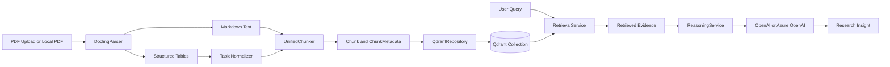
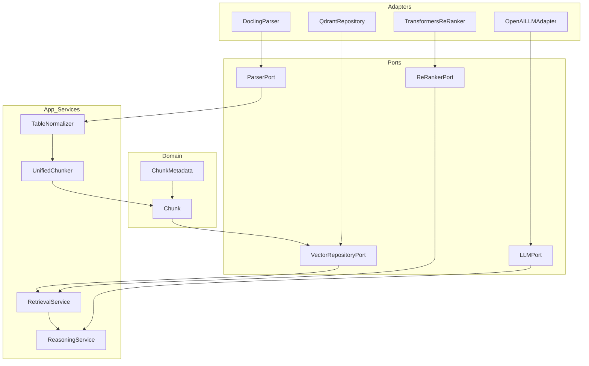

# Medical Research RAG Pipeline

A modular Retrieval-Augmented Generation (RAG) system for medical research PDFs. The current implementation ingests PDFs, extracts narrative text and tables, normalizes tabular artifacts, chunks documents in a structure-aware way, stores chunks in Qdrant, retrieves evidence from the knowledge base, and optionally synthesizes research answers with an LLM.

Current project focus:
- the active proving ground is the promoted stage-1 `20`-PDF alias `medical_research_chunks_docling_active`, not broader corpus-scale architecture
- the next bottleneck is benchmark quality, not raw document-hit retrieval
- metadata and ingestion hardening now matter more than new retrieval stages
- the immediate next benchmark task is absent-answer and false-positive coverage in the answer-quality layer

Current benchmark status:
- stage-1 retrieval coverage on the active `20`-PDF alias `medical_research_chunks_docling_active` is now tracked with an `88`-query benchmark in `data/eval/stage1_coverage_queries.json`
- current `2026-04-10` stage-1 coverage rerun metrics:
  - expected doc hit rate: `1.0`
  - top-1 expected doc hit rate: `1.0`
  - average doc precision: `1.0`
  - cross-document average doc precision: `1.0`
  - expected header hit rate: `1.0`
  - top-1 expected header hit rate: `0.8182`
  - average header precision: `0.793`
- a follow-up `2026-04-10` narrowing pass resolved the remaining `S1C29`, `S1C30`, and `S1C61` section-selection misses without regressing document precision; the remaining benchmark debt is now mainly top-1 header ordering
- top-1 header ordering remains a watch metric, but further retrieval tuning should be inspection-led rather than proactive
- `data/eval/answer_quality_queries.json` now also includes plausible-but-absent queries so the stage-1 synthesis benchmark can measure false-positive and over-confident answering on the current `20`-PDF corpus
- current `2026-04-10` expanded stage-1 answer-quality rerun on `data/eval/answer_quality_queries.json`:
  - queries total: `31`
  - abstain accuracy: `1.0`
  - confidence meets minimum rate: `0.8125`
  - average doc ID coverage: `0.9821`
- the expanded absent-answer slice now abstains cleanly on the current `20`-PDF corpus after narrow reasoning guards for missing named comparators and exact subgroup-summary requests
- synthesis watch items still worth keeping visible: `AQ10` and `AQ13`
- retrieval is now tracked on both a stable 26-query benchmark and a broader 43-query expanded benchmark
- the 26-query `data/eval/sample_queries.json` file remains the stable retrieval baseline; `data/eval/expanded_queries.json` extends coverage for stewardship, review-style, title-query, and table-oriented evaluation
- `data/eval/ood_adversarial_queries.json` is now the separate clinician-style and adversarial phrasing track; it is evaluation-only and should not replace the stable baseline or the expanded benchmark
- stable 26-query baseline (`data/eval/sample_queries.json`) from the current March 23, 2026 rerun on `medical_research_chunks_v1`:
  - expected doc hit rate: `1.0`
  - expected header hit rate: `1.0`
  - top-1 expected doc hit rate: `1.0`
  - top-1 expected header hit rate: `1.0`
  - average doc precision: `1.0`
  - average header precision: `1.0`
  - cross-document average doc precision: `1.0`
  - citation noise queries: `1`
  - table-hit queries: `4`
  - non-structural header queries: `0`
- expanded 43-query benchmark (`data/eval/expanded_queries.json`) from the current March 23, 2026 rerun on `medical_research_chunks_v1`:
  - expected doc hit rate: `1.0`
  - expected header hit rate: `1.0`
  - top-1 expected doc hit rate: `1.0`
  - top-1 expected header hit rate: `1.0`
  - average doc precision: `1.0`
  - average header precision: `1.0`
  - cross-document average doc precision: `1.0`
  - citation noise queries: `1`
  - table-hit queries: `6`
  - non-structural header queries: `0`
- the March 23, 2026 rerun now shows perfect stable and expanded benchmark precision on the current corpus after two narrow final-selection suppressions removed residual `Methods`, `Introduction`, and conclusion-tail `Results` noise from doc-filtered queries
- OOD/adversarial benchmark (`data/eval/ood_adversarial_queries.json`) from the current March 23, 2026 rerun on `medical_research_chunks_v1`:
  - expected doc hit rate: `1.0`
  - expected header hit rate: `1.0`
  - top-1 expected doc hit rate: `1.0`
  - top-1 expected header hit rate: `1.0`
  - average doc precision: `1.0`
  - average header precision: `1.0`
  - cross-document average doc precision: `1.0`
  - citation noise queries: `0`
  - table-hit queries: `2`
  - non-structural header queries: `0`
- the March 23, 2026 OOD rerun now resolves the remaining OOD precision cases as well, so the stable, expanded, and OOD tracks all sit at `1.0` doc/header precision on the current collection
- current retrieval baseline is metadata-first filtering in Qdrant plus a smaller query-dependent ranking/diversity layer
- preserving markdown table placement during parsing improved table retrieval after re-ingestion
- thematic markdown headings for header-poor papers are now normalized back to stable retrieval sections while preserving the original header in metadata
- explicit `Table N` references are now preserved in chunk metadata so explicit table queries can recover linked prose evidence when parser output leaves the table callout in narrative text
- table chunks now carry semantic metadata such as metric/comparison flags and lightweight captions to support payload-driven filtering after rebuilds
- returned table chunks now prepend lightweight caption and linked-prose context when metadata establishes a table-prose linkage, improving answer context without adding a new retrieval stage
- metadata-linked table context is no longer limited to literal `Table N` mentions; ingestion can also attach same-section prose when caption/table terminology overlaps strongly enough to support a narrow semantic linkage
- rebuild, UI ingestion, and single-document repair now fail fast on duplicate document identities (`doc_id`, `source_file`, `local_file`) instead of silently creating parallel entries for the same source PDF
- rebuild, UI ingestion, and single-document repair now also persist `ingestion_version`, `chunker_version`, `source_sha256`, and `file_size_bytes` consistently across chunk payloads, rebuild manifests, and registry entries while still writing the legacy `chunking_version` field for compatibility
- rebuild, UI ingestion, and single-document repair now also fail loud on Qdrant write errors instead of logging partial batch failures and continuing with a misleading success path
- single-document repair now snapshots the existing Qdrant points before replacement and restores them directly if the replacement write fails, so a failed repair does not leave the collection missing the original document unless rollback itself also fails
- collection rebuild now refuses to recreate an existing Qdrant collection unless `--allow-recreate-existing-collection` is passed explicitly, so the default path encourages staged rebuilds into fresh collection names instead of mutating an active collection in place
- `scripts/promote_collection_alias.py` can now atomically move a stable Qdrant alias to a validated staged collection and snapshot an alias-specific manifest/registry view for downstream audit and UI flows
- `scripts/build_rollout_report.py` can now include a ready-to-run promotion command for `scripts/promote_collection_alias.py` when the overall rollout report passes and a `--promotion-alias` is supplied
- `scripts/audit_collection_state.py` now reports duplicate identity conflicts and can emit a non-destructive cleanup plan before any manual corpus reconciliation work
- `scripts/audit_collection_state.py` now also reports chunk-count sanity failures for empty docs, broken chunk breakdowns, and extreme per-doc outliers before rollout promotion
- `scripts/audit_collection_state.py` now also reports per-doc metadata mismatches across Qdrant, manifest, and registry and includes a small repair-plan payload for registry sync and targeted follow-up review
- `scripts/rebuild_collection.py` now supports batch-oriented `--continue-on-error` operation plus an optional structured failure report so larger rebuilds can retain successful documents while surfacing per-file failures explicitly
- next benchmark work is keeping the stable and expanded records separate while validating that future retrieval or ingestion changes do not regress the now-clean baseline
- hybrid dense+sparse retrieval and ontology-backed query expansion are recognized future options, but they are not the current priority because the present benchmark debt is concentrated in metadata/header quality rather than document-hit recall
- benchmark diversification is now a near-term need: add a separate out-of-distribution evaluation track with clinician-style, journal-club-style, shorthand, and paraphrased queries so retrieval is not tuned only to developer-authored prompt patterns
- the OOD/adversarial track should be run with separate JSON/CSV output paths so its noisier phrasing cases do not overwrite the baseline result artifacts
- current OOD debugging confirmed the stewardship-review miss was not a candidate-recall problem: the Fabre paper was already present in early candidates, and a narrow document-level disambiguation step was enough to resolve `O03` and `O10` without broader ranking changes
- before any further retrieval changes, the repo should diagnose and explain any header-precision or table-hit drift on the stable 26-query and expanded 43-query benchmarks before stacking new behavior on top
- parser experimentation should happen inside this repo as an isolated bakeoff workflow, not as a separate project and not by destabilizing the active `Docling` ingestion path
- current operational stance: use `Docling` for new ingestion, use `medical_research_chunks_docling_active` as the active promoted alias, retain `medical_research_chunks_docling_v2_batch1` as the recorded stage-1 artifact, keep `medical_research_chunks_docling_v1` as the older small-corpus baseline, and keep `Marker` plus `medical_research_chunks_v1` as rollback only
- the next major step is better signal on the current `20`-PDF stage: harder benchmarks, better absent-answer coverage, and stronger ingestion sanity checks
- with the current `20`-PDF corpus, benchmark expansion and ingestion metadata hardening matter more than new retrieval stages; document-level candidate retrieval remains deferred

## What It Does

- Parses PDFs into Markdown and structured tables using the active `Docling` parser, with `Marker` preserved as rollback
- Normalizes extracted tables before chunking
- Chunks text and tables differently:
  - text: paragraph-aware sliding windows
  - tables: atomic structural chunks
- Stores chunk embeddings and metadata in Qdrant
- Retrieves evidence from the indexed knowledge base
- Supports optional local re-ranking
- Supports LLM-based research synthesis with OpenAI or Azure OpenAI
- Includes a Streamlit UI for upload, ingestion, retrieval, and research Q&A

## End-to-End Flow



## Architecture

The project follows Hexagonal Architecture (Ports and Adapters). Core logic depends on internal models and explicit contracts, while infrastructure integrations stay isolated behind adapters.



## Project Structure

```text
src/
├─ domain/
│  └─ models/
│     └─ chunk.py
├─ ports/
│  └─ parser_port.py
├─ adapters/
│  └─ parsing/
│     ├─ docling_parser.py
│     └─ marker_parser.py
└─ app/
   ├─ adapters/
   │  ├─ llm/
   │  │  └─ openai_llm_adapter.py
   │  ├─ rerankers/
   │  │  └─ transformers_reranker.py
   │  └─ vectorstores/
   │     └─ qdrant_repository.py
   ├─ ports/
   │  ├─ llm_port.py
   │  ├─ re_ranker_port.py
   │  └─ repositories/
   │     └─ vector_repository.py
   ├─ prompts/
   │  └─ research_prompt.py
   ├─ services/
   │  ├─ reasoning_service.py
   │  └─ retrieval_service.py
   └─ tables/
      ├─ table_chunker.py
      └─ table_normalizer.py

scripts/
├─ test_single_pdf.py
├─ test_chunk_from_artifacts.py
├─ test_e2e_flow.py
└─ ui_app.py
```

## Core Components

### Parsing

- [docling_parser.py](src/adapters/parsing/docling_parser.py)
- [marker_parser.py](src/adapters/parsing/marker_parser.py)
- [parser_port.py](src/ports/parser_port.py)

The repo supports both parser adapters behind the same parser contract:
- `Docling` is the active parser for new ingestion
- `Marker` is preserved as the rollback parser
- parser choice is selected at ingestion time through the parser factory and ingestion entry points

The active parser path converts a PDF into:
- `markdown_text`
- extracted `tables`

Tables are separated from the main text instead of being flattened into plain narrative content.

### Table Processing

- [table_normalizer.py](src/app/tables/table_normalizer.py)
- [table_chunker.py](src/app/tables/table_chunker.py)

`TableNormalizer` trims metadata/title rows from the top of extracted tables and preserves trimmed metadata as an artifact when available.

`UnifiedChunker` processes the document as a whole:
- text is chunked with paragraph-aware sliding windows
- tables remain atomic units with contextual headers
- text and table chunks now carry richer retrieval metadata including ingestion/chunking versions, canonical/original headers, local/source file paths, and table semantic flags
- the local knowledge-base registry now hydrates collection document summaries from the rebuild manifest when present, reducing drift between the UI registry and manifest-tracked corpus state
- document ID derivation is now centralized across rebuild, UI ingestion, single-doc repair, and local test scripts; the current filename-stem-based naming style is preserved, but ad hoc per-script drift has been removed

### Retrieval and Re-Ranking

- [retrieval_service.py](src/app/services/retrieval_service.py)
- [vector_repository.py](src/app/ports/repositories/vector_repository.py)
- [qdrant_repository.py](src/app/adapters/vectorstores/qdrant_repository.py)
- [re_ranker_port.py](src/app/ports/re_ranker_port.py)
- [transformers_reranker.py](src/app/adapters/rerankers/transformers_reranker.py)

Retrieval is two-stage:
1. vector search in Qdrant
2. optional cross-encoder re-ranking

The system currently supports collection-wide retrieval across the active knowledge base.

Retrieval policy is split as follows:
- payload/Qdrant filtering handles static eligibility such as references, front matter, low-value chunks, and table-oriented gating
- application ranking keeps only query-dependent logic such as section weighting, document locking, duplicate suppression, and diversity caps
- future retrieval extensions should follow the same rule: add new behavior only when benchmark evidence shows a concrete gap, and prefer explicit metadata/filtering over implicit query branching

### Reasoning

- [reasoning_service.py](src/app/services/reasoning_service.py)
- [research_prompt.py](src/app/prompts/research_prompt.py)
- [openai_llm_adapter.py](src/app/adapters/llm/openai_llm_adapter.py)

`ReasoningService` builds on retrieved evidence and uses an LLM to synthesize a research answer. The current UI supports both OpenAI and Azure OpenAI.

## Data Model

The central retrieval unit is `Chunk`.

```python
from dataclasses import dataclass, field
from typing import Any, Optional

@dataclass(frozen=True)
class ChunkMetadata:
    doc_id: str
    chunk_type: str
    parent_header: str
    page_number: Optional[int] = None
    extra: dict[str, Any] = field(default_factory=dict)

@dataclass(frozen=True)
class Chunk:
    id: str
    content: str
    metadata: ChunkMetadata
```

Why the nested metadata shape matters:
- it maps cleanly to Qdrant payload fields
- it keeps embedding content separate from filterable attributes
- it makes metadata expansion explicit without changing the retrieval contract

## Runtime Requirements

### Python

- Python 3.11 is the safest target in this repo

### Services

- Qdrant running locally or remotely
- `Docling` is the recommended parser for new ingestion; `Marker` remains available as rollback
- OpenAI or Azure OpenAI credentials for embeddings
- Optional OpenAI or Azure OpenAI credentials for answer synthesis

## Setup

The checked-in `requirements.txt` and `.env.example` are the base setup surface for this repo.

Important runtime note:
- the main CLI testing scripts and the Streamlit UI now auto-load `.env` via `python-dotenv`
- copying `.env.example` to `.env` is the intended local setup path for collection, Qdrant, and embedding defaults
- keep concrete values in `.env`; do not rely on `${OTHER_VAR}` interpolation unless your own shell loader expands it before Python starts

Create a virtual environment and upgrade `pip`:

```powershell
py -3.11 -m venv .venv
.\.venv\Scripts\Activate.ps1
python -m pip install --upgrade pip
```

```bash
python3.11 -m venv .venv
source .venv/bin/activate
python -m pip install --upgrade pip
```

Install the base dependencies:

```powershell
python -m pip install -r requirements.txt
```

If you want to use the active `Docling` parser path for ingestion, install `Docling` separately after the base requirements.
The checked-in `requirements.txt` remains the minimum supported setup surface, but it does not currently include the `Docling` package itself.

```powershell
python -m pip install docling
```

```bash
python -m pip install -r requirements.txt
```

```bash
python -m pip install docling
```

Create a local env file from the checked-in template:

```powershell
Copy-Item .env.example .env
```

```bash
cp .env.example .env
```

### Required Environment Variables

For embeddings:

- `EMBEDDING_PROVIDER`: `openai` or `azure_openai`
- `EMBEDDING_MODEL`: OpenAI embedding model name or Azure embedding deployment name
- `EMBEDDING_DIMENSIONS`: embedding vector size; set `0` to use provider default when supported
- `EMBEDDING_API_KEY`: required by the retrieval and ingestion scripts unless `OPENAI_API_KEY` is being used as the fallback for OpenAI embeddings

For Azure OpenAI embeddings only:

- `EMBEDDING_AZURE_OPENAI_ENDPOINT` or `AZURE_OPENAI_ENDPOINT`
- `EMBEDDING_AZURE_OPENAI_API_VERSION` or `AZURE_OPENAI_API_VERSION`

PowerShell note:
- if you use the README's PowerShell loader, set `EMBEDDING_AZURE_OPENAI_ENDPOINT` and `EMBEDDING_AZURE_OPENAI_API_VERSION` to explicit values in `.env`
- a line like `EMBEDDING_AZURE_OPENAI_ENDPOINT=${AZURE_OPENAI_ENDPOINT}` will stay literal and break Azure embedding calls

For Qdrant:

- `QDRANT_URL`: documented base URL for your Qdrant instance
- `QDRANT_COLLECTION`: documented default collection name for this repo

Current behavior note:
- the UI and main CLI testing scripts auto-read `QDRANT_URL` and `QDRANT_COLLECTION` from `.env`
- the active default collection is now `medical_research_chunks_docling_v1`
- the preserved rollback collection remains `medical_research_chunks_v1`, so set that collection explicitly only when you intentionally want the old `Marker` baseline

For optional answer synthesis:

- `OPENAI_API_KEY`: used by the Streamlit UI for answer synthesis by default; also acts as the fallback key for OpenAI embeddings
- `OPENAI_MODEL`: OpenAI chat model name or Azure chat deployment name for answer synthesis
- `AZURE_OPENAI_ENDPOINT`: required for Azure OpenAI answer synthesis
- `AZURE_OPENAI_API_VERSION`: required for Azure OpenAI answer synthesis

### Dependency Notes

- `requirements.txt` is the supported base install
- local re-ranking support is already included there via `transformers`
- the `torch` dependency is pinned to the CPU wheel index in `requirements.txt`

## Run Qdrant

```powershell
docker run --rm -p 6333:6333 -p 6334:6334 qdrant/qdrant
```

```bash
docker run --rm -p 6333:6333 -p 6334:6334 qdrant/qdrant
```

## Run the UI

```powershell
python -m streamlit run scripts/ui_app.py
```

```bash
python -m streamlit run scripts/ui_app.py
```

Before using the UI:
- start Qdrant first
- keep your local `.env` populated so collection and embedding defaults preload automatically
- provide or adjust any credentials in the sidebar only when you want to override `.env`
- if you want to use the preserved rollback collection, change the sidebar collection from `medical_research_chunks_docling_v1` to `medical_research_chunks_v1`

The UI supports:
- PDF upload and ingestion
- persistent knowledge-base registry
- evidence retrieval
- optional local re-ranking
- research question answering with OpenAI or Azure OpenAI

## Local Test Commands

Run unit tests first:

```powershell
.\.venv\Scripts\python.exe -m pytest -q tests/unit --basetemp .pytest_tmp_run
```

```bash
python -m pytest -q tests/unit --basetemp .pytest_tmp_run
```

Test parsing on one PDF:

```powershell
.\.venv\Scripts\python.exe scripts/test_single_pdf.py --pdf "data/raw_pdfs/your_file.pdf"
```

Test chunking from generated artifacts:

```powershell
.\.venv\Scripts\python.exe scripts/test_chunk_from_artifacts.py --parsed-dir "data/parsed_debug" --doc-stem "your_file"
```

Run an end-to-end ingestion and retrieval flow:

```powershell
.\.venv\Scripts\python.exe scripts/test_e2e_flow.py --pdf "data/raw_pdfs/your_file.pdf" --query "What does the paper say about lipid biomarkers?" --recreate-collection
```

```bash
python scripts/test_e2e_flow.py --pdf "data/raw_pdfs/your_file.pdf" --query "What does the paper say about lipid biomarkers?" --recreate-collection
```

`scripts/test_e2e_flow.py` now defaults to `QDRANT_COLLECTION` from `.env` and falls back to `medical_research_chunks_docling_v1`. Pass `--collection medical_research_chunks_v1` only if you intentionally want to point it at the preserved rollback collection.

Runtime-focused evaluation sets now include:
- `data/eval/runtime_queries.json` for real app usage regressions
- `data/eval/known_gap_queries.json` for figure/table/contrastive gap tracking that should stay separate from the runtime baseline

Run the retrieval evaluation harness against the active `Docling` collection:

```powershell
.\.venv\Scripts\python.exe scripts/evaluate_retrieval.py --collection medical_research_chunks_docling_v1 --dataset data/eval/sample_queries.json --embedding-provider azure_openai --embedding-model "your-embedding-deployment-name"
```

```bash
python scripts/evaluate_retrieval.py --collection medical_research_chunks_docling_v1 --dataset data/eval/sample_queries.json --embedding-provider azure_openai --embedding-model "your-embedding-deployment-name"
```

When `--json-out` and `--csv-out` are omitted, the stable baseline now writes to `data/eval/results/retrieval_eval_sample.json` and `data/eval/results/retrieval_eval_sample.csv` by default so it does not overwrite broader benchmark runs.

Run the expanded benchmark without changing the stable baseline dataset:

```powershell
.\.venv\Scripts\python.exe scripts/evaluate_retrieval.py --collection medical_research_chunks_docling_v1 --dataset data/eval/expanded_queries.json --embedding-provider azure_openai --embedding-model "your-embedding-deployment-name"
```

```bash
python scripts/evaluate_retrieval.py --collection medical_research_chunks_docling_v1 --dataset data/eval/expanded_queries.json --embedding-provider azure_openai --embedding-model "your-embedding-deployment-name"
```

The expanded benchmark now defaults to `data/eval/results/retrieval_eval_expanded.json` and `data/eval/results/retrieval_eval_expanded.csv`, keeping the stable and expanded records separate unless you explicitly override the paths.

Run the separate OOD/adversarial phrasing track with its own result files:

```powershell
.\.venv\Scripts\python.exe scripts/evaluate_retrieval.py --collection medical_research_chunks_docling_v1 --dataset data/eval/ood_adversarial_queries.json --embedding-provider azure_openai --embedding-model "your-embedding-deployment-name" --json-out data/eval/results/ood_retrieval_eval.json --csv-out data/eval/results/ood_retrieval_eval.csv
```

```bash
python scripts/evaluate_retrieval.py --collection medical_research_chunks_docling_v1 --dataset data/eval/ood_adversarial_queries.json --embedding-provider azure_openai --embedding-model "your-embedding-deployment-name" --json-out data/eval/results/ood_retrieval_eval.json --csv-out data/eval/results/ood_retrieval_eval.csv
```

Inspect one OOD query across retrieval stages before changing ranking logic:

```powershell
.\.venv\Scripts\python.exe scripts/inspect_retrieval_candidates.py --query-id O03 --dataset data/eval/ood_adversarial_queries.json --collection medical_research_chunks_docling_v1 --embedding-provider azure_openai --embedding-model "your-embedding-deployment-name"
```

```bash
python scripts/inspect_retrieval_candidates.py --query-id O03 --dataset data/eval/ood_adversarial_queries.json --collection medical_research_chunks_docling_v1 --embedding-provider azure_openai --embedding-model "your-embedding-deployment-name"
```

Deterministically rebuild a staged `Docling` collection from the uploaded benchmark PDFs:

```powershell
.\.venv\Scripts\python.exe scripts/rebuild_collection.py --pdf-dir data/raw_pdfs/uploaded --collection medical_research_chunks_docling_v2_batch2_candidate --parser docling --embedding-provider azure_openai --embedding-model "your-embedding-deployment-name"
```

If you want a medium-scale batch rebuild to continue past per-file failures while still recording them for follow-up:

```powershell
.\.venv\Scripts\python.exe scripts/rebuild_collection.py --pdf-dir data/raw_pdfs/uploaded --collection medical_research_chunks_docling_v2_batch2_candidate --parser docling --embedding-provider azure_openai --embedding-model "your-embedding-deployment-name" --continue-on-error --failure-report-out data/eval/results/rebuild_failures_medical_research_chunks_docling_v2_batch2_candidate.json
```

If `--manifest-out` is omitted, rebuilds now default to `data/ingestion_manifests/<collection>_rebuild_manifest.json`, which keeps the rebuild output aligned with the default audit and reingest workflow for the same collection. With `--continue-on-error`, successful documents are still written into the rebuilt collection and manifest, the JSON failure report captures per-file errors, and the command still exits with code `1` if any failures occurred so automation can flag the batch for follow-up. If `--failure-report-out` is omitted, the report now defaults to `data/eval/results/rebuild_failures_<collection>.json`. Rebuild now refuses to recreate an existing collection unless `--allow-recreate-existing-collection` is passed explicitly, so the default operator path is to build into a fresh staged collection name and promote it only after validation.

Reparse and replace a single document in an existing collection, optionally syncing the rebuild manifest entry at the same time:

```powershell
.\.venv\Scripts\python.exe scripts/reingest_single_doc.py --doc-id "your-doc-id" --pdf "data/raw_pdfs/uploaded/your_file.pdf" --collection medical_research_chunks_docling_v1 --parser docling --embedding-provider azure_openai --embedding-model "your-embedding-deployment-name" --manifest data/ingestion_manifests/medical_research_chunks_docling_v1_rebuild_manifest.json
```

If you want a structured failure record for a repair attempt:

```powershell
.\.venv\Scripts\python.exe scripts/reingest_single_doc.py --doc-id "your-doc-id" --pdf "data/raw_pdfs/uploaded/your_file.pdf" --collection medical_research_chunks_docling_v1 --parser docling --embedding-provider azure_openai --embedding-model "your-embedding-deployment-name" --manifest data/ingestion_manifests/medical_research_chunks_docling_v1_rebuild_manifest.json --failure-report-out data/eval/results/reingest_failure_your_doc_id.json
```

The single-document repair flow now writes stage-specific failure context, covering malformed manifest JSON and other manifest-validation failures, embedding preflight, parse, chunk, delete, upsert, and manifest-update failures. If `--failure-report-out` is omitted, the report now defaults to `data/eval/results/reingest_failure_<collection>_<doc_id>.json`.

Export stored chunks from Qdrant for validation:

```powershell
.\.venv\Scripts\python.exe scripts/export_qdrant_chunks.py --collection medical_research_chunks_docling_v1 --csv-out data/exports/current_chunks_docling_v1.csv
```

Audit one collection across Qdrant, the rebuild manifest, and the local registry, and optionally sync the registry from the manifest before reporting:

```powershell
.\.venv\Scripts\python.exe scripts/audit_collection_state.py --collection medical_research_chunks_docling_v1 --sync-registry --json-out data/eval/results/collection_audit_medical_research_chunks_docling_v1.json
```

Write a non-destructive duplicate cleanup plan from the same audit metadata without changing the collection:

```powershell
.\.venv\Scripts\python.exe scripts/audit_collection_state.py --collection medical_research_chunks_docling_v1 --cleanup-plan-out data/eval/results/collection_cleanup_plan_docling_v1.json
```

Use the audit as an explicit rollout gate for Phase 5 or any medium-scale ingest batch:

```powershell
.\.venv\Scripts\python.exe scripts/audit_collection_state.py --collection medical_research_chunks_docling_v1 --sync-registry --json-out data/eval/results/collection_audit_medical_research_chunks_docling_v1.json --cleanup-plan-out data/eval/results/collection_cleanup_plan_docling_v1.json --fail-on-issues
```

Compile the stage gate into one rollout report after rebuild, audit, benchmark reruns, and manual spot checks. When the report passes, it can now emit the next promotion command directly:

```powershell
.\.venv\Scripts\python.exe scripts/build_rollout_report.py --collection medical_research_chunks_docling_v2_batch2_candidate --stage-label stage-2-50-pdfs-candidate --target-pdf-count 50 --audit-json data/eval/results/collection_audit_medical_research_chunks_docling_v2_batch2_candidate.json --stable-eval-json data/eval/results/retrieval_eval_sample_stage2_candidate.json --expanded-eval-json data/eval/results/retrieval_eval_expanded_stage2_candidate.json --ood-eval-json data/eval/results/ood_retrieval_eval_stage2_candidate.json --runtime-eval-json data/eval/results/retrieval_eval_runtime_stage2_candidate.json --baseline-stable-eval-json data/eval/results/retrieval_eval_sample_stage1.json --baseline-expanded-eval-json data/eval/results/retrieval_eval_expanded_stage1.json --baseline-ood-eval-json data/eval/results/ood_retrieval_eval_stage1.json --baseline-runtime-eval-json data/eval/results/retrieval_eval_runtime_stage1.json --manual-spot-checks data/eval/results/manual_spot_checks_stage2_candidate.json --promotion-alias medical_research_chunks_docling_active --promotion-json-out data/eval/results/promotion_stage2_candidate.json
```

When that report ends in `pass`, it will include a promotion command shaped like:

```powershell
.\.venv\Scripts\python.exe scripts/promote_collection_alias.py --source-collection medical_research_chunks_docling_v2_batch2_candidate --alias medical_research_chunks_docling_active --qdrant-url http://localhost:6333 --registry data/kb_registry.json --json-out data/eval/results/promotion_stage2_candidate.json
```

The manual spot-check file can be a JSON array, or an object with `checks`, using records like:

```json
[
  {
    "query": "Which paper should I read for blood-culture turnaround improvements, not stewardship policy?",
    "status": "pass",
    "observed": "Returned the RAPID turnaround evidence first.",
    "expected": "Keep turnaround-focused RAPID evidence ahead of stewardship-review chunks.",
    "repeated": true
  }
]
```

Manifest-aware repair paths now enforce collection and ingestion/chunking version compatibility before updating local records, so a stale or mismatched manifest fails fast instead of being silently reused.
The audit path now also fails fast on malformed manifest JSON instead of crashing during load, and it surfaces duplicate `doc_id`, `source_file`, and `local_file` conflicts explicitly; if the cleanup plan is empty, Qdrant, manifest, and registry agree on document identity at the metadata level. With `--fail-on-issues`, the command returns exit code `1` for any manifest version issue, reconciliation issue, or cleanup-plan step.

Rollback note:
- if you intentionally want to operate on the preserved `Marker` baseline instead, swap `medical_research_chunks_docling_v1` for `medical_research_chunks_v1` in the commands above and omit `--parser docling`

## Recommended Batch Workflow

For medium-scale ingestion work, the current operator path is:

1. Rebuild into a fresh staged collection name with manifest output:

```powershell
.\.venv\Scripts\python.exe scripts/rebuild_collection.py --pdf-dir data/raw_pdfs/uploaded --collection medical_research_chunks_docling_v2_batch2_candidate --parser docling --embedding-provider azure_openai --embedding-model "your-embedding-deployment-name" --continue-on-error
```

2. Review any rebuild failures written to `data/eval/results/rebuild_failures_medical_research_chunks_docling_v2_batch2_candidate.json`.

3. Repair individual documents inside that staged collection as needed:

```powershell
.\.venv\Scripts\python.exe scripts/reingest_single_doc.py --doc-id "your-doc-id" --pdf "data/raw_pdfs/uploaded/your_file.pdf" --collection medical_research_chunks_docling_v2_batch2_candidate --parser docling --embedding-provider azure_openai --embedding-model "your-embedding-deployment-name" --manifest data/ingestion_manifests/medical_research_chunks_docling_v2_batch2_candidate_rebuild_manifest.json
```

4. Review any single-document repair failures under `data/eval/results/reingest_failure_<collection>_<doc_id>.json`.

5. Run the audit gate against the staged collection before treating it as rollout-ready:

```powershell
.\.venv\Scripts\python.exe scripts/audit_collection_state.py --collection medical_research_chunks_docling_v2_batch2_candidate --sync-registry --json-out data/eval/results/collection_audit_medical_research_chunks_docling_v2_batch2_candidate.json --cleanup-plan-out data/eval/results/collection_cleanup_plan_docling_v2_batch2_candidate.json --fail-on-issues
```

6. Compile the rollout-stage report after benchmark reruns and manual spot checks, with a promotion alias configured:

```powershell
.\.venv\Scripts\python.exe scripts/build_rollout_report.py --collection medical_research_chunks_docling_v2_batch2_candidate --stage-label stage-2-50-pdfs-candidate --target-pdf-count 50 --audit-json data/eval/results/collection_audit_medical_research_chunks_docling_v2_batch2_candidate.json --stable-eval-json data/eval/results/retrieval_eval_sample_stage2_candidate.json --expanded-eval-json data/eval/results/retrieval_eval_expanded_stage2_candidate.json --ood-eval-json data/eval/results/ood_retrieval_eval_stage2_candidate.json --runtime-eval-json data/eval/results/retrieval_eval_runtime_stage2_candidate.json --baseline-stable-eval-json data/eval/results/retrieval_eval_sample_stage1.json --baseline-expanded-eval-json data/eval/results/retrieval_eval_expanded_stage1.json --baseline-ood-eval-json data/eval/results/ood_retrieval_eval_stage1.json --baseline-runtime-eval-json data/eval/results/retrieval_eval_runtime_stage1.json --manual-spot-checks data/eval/results/manual_spot_checks_stage2_candidate.json --promotion-alias medical_research_chunks_docling_active --promotion-json-out data/eval/results/promotion_stage2_candidate.json
```

7. If the rollout report ends in `pass`, run the generated promotion command to move the stable alias to the staged collection:

```powershell
.\.venv\Scripts\python.exe scripts/promote_collection_alias.py --source-collection medical_research_chunks_docling_v2_batch2_candidate --alias medical_research_chunks_docling_active --qdrant-url http://localhost:6333 --registry data/kb_registry.json --json-out data/eval/results/promotion_stage2_candidate.json
```

This keeps the operational loop explicit: staged rebuild, inspect failures, repair specific documents, run the audit gate, rerun the evaluation sets, document manual spot checks, compile one rollout-stage report, then promote only on pass.

## Production Track

Current recommended operational policy:
- active parser for new ingestion: `Docling`
- active collection family: `medical_research_chunks_docling_*`
- rollback parser and collection: `Marker` and `medical_research_chunks_v1`
- runtime benchmark is the main retrieval-change gate on the active `Docling` line
- parser bakeoff and retrieval experiments stay outside the production path until they clear the same gates

The next repo milestone should be medium-scale readiness for roughly `100 PDFs`, reached through staged rollouts rather than another broad retrieval redesign:
- stage 1: `20 PDFs`
- stage 2: `50 PDFs`
- stage 3: `100 PDFs`
- use a new `Docling` collection for each stage, such as `medical_research_chunks_docling_v2_batch1`
- in each stage, curate papers that mix RCTs, observational studies, reviews, table-heavy papers, OCR-weaker PDFs, and abbreviation-heavy assay papers
- require the same operator gate each time:
  - rebuild finishes with explicit failure reporting
  - `scripts/audit_collection_state.py --fail-on-issues` passes
  - stable and expanded benchmarks stay within acceptable tolerance
  - runtime benchmark shows no material regression
  - a small manual medical-question spot-check pass is documented
- add a corpus-scale evaluation lens before treating `100 PDFs` as stable:
  - multi-document ambiguity
  - similar study titles
  - same-topic papers with conflicting findings
  - table-heavy queries
  - review-versus-trial disambiguation
- latest rollout checkpoint from March 31, 2026:
  - `medical_research_chunks_docling_v2_batch1` is now the recorded stage-1 `20`-PDF rollout checkpoint
  - rebuild and audit passed cleanly on that collection
  - promotion did not pass:
    - stable benchmark regressed beyond the current rollout tolerance, especially cross-document average doc precision
    - expanded benchmark regressed beyond tolerance
    - OOD benchmark regressed materially in the first compiled rollout report, with `O11` as the measured blocker at that checkpoint
    - runtime remained weaker than the small-corpus line and did not justify promotion
  - the resulting rollout-stage artifact is a deliberate no-promote checkpoint, not a collection to build stage 2 on top of
  - do not start the `50`-PDF stage from this state
  - April 1, 2026 narrow follow-up checkpoint:
    - local follow-up artifacts resolved the earlier OOD blocker `O11`, but stage 1 still remained blocked on broad cross-document precision and missing manual spot checks
  - April 1, 2026 promoted stage-1 checkpoint:
    - two narrow retrieval fixes cleared the remaining stage-1 regression families:
      - broad diagnostic-metric prompts no longer treat the substring `uti` inside unrelated words like `utilization` as an infectious-domain hit
      - study-design classification prompts now use a stricter in-domain matcher so unrelated retrospective papers do not leak into final results through generic `study` / `results` language
    - targeted regression tests now cover both failure shapes in `RetrievalService`
    - rerunning `sample_queries.json`, `expanded_queries.json`, `runtime_queries.json`, and `ood_adversarial_queries.json` on `medical_research_chunks_docling_v2_batch1` now matches the small-corpus baselines on rollout-gated summary metrics
    - a fresh manual spot-check artifact is recorded at `data/eval/results/manual_spot_checks_stage1.json`
    - the regenerated rollout report at `data/eval/results/rollout_report_medical_research_chunks_docling_v2_batch1.json` now ends in `pass`
    - important coverage caveat: the current stable, expanded, runtime, OOD, and known-gap datasets still only exercise the original `7` baseline papers, not the full `20`-PDF stage corpus
    - this means the stage-1 pass is a valid non-regression checkpoint against the documented gate, but it is not yet strong evidence that all `13` newly added papers retrieve correctly
    - before treating the `20`-PDF stage as fully de-risked for stage 2, add explicit corpus-coverage evaluation for the new papers:
      - at least one single-document factual retrieval query per newly added paper
      - cross-document ambiguity queries that mix baseline and newly added papers
      - hepcidin-cluster disambiguation queries, since those same-topic papers are the clearest early medium-scale ambiguity risk
      - additional manual UI spot checks biased toward the newly added papers
      - spot-check audits on selected zero-table-chunk papers to confirm whether missing tables are real or parser gaps
    - keep `runtime_queries.json` for real app/runtime questions; put synthetic stage-coverage probes into a separate evaluation dataset rather than mixing them into the runtime baseline
    - `medical_research_chunks_docling_v2_batch1` should now be treated as the current approved stage-1 baseline for planning, but stage 2 should still begin only after that extra coverage work or with the stage-2 risk accepted explicitly
    - after the stage-coverage gap is closed, the next highest-value product hardening work should be:
      - pin dependencies so parser and reranker upgrades cannot silently drift behavior between checkpoints
      - strengthen medical answer synthesis with stricter prompt instructions around study design, effect sizes, uncertainty, and limitations
      - move from free-form answer text toward structured answer output with explicit chunk-level citations
      - add a programmatic abstention or confidence signal rather than relying only on prompt wording such as `Insufficient evidence`
      - add a small answer-quality evaluation layer so final synthesis quality is measured separately from retrieval quality
      - improve the UI collection-selection workflow for safer rollback and A/B comparison during rollout
      - add basic observability for query latency and retrieved-chunk inspection during larger-batch testing
    - still defer hybrid or sparse retrieval until benchmark evidence shows clear lexical recall gaps, and defer multi-turn conversation support until grounding and answer reliability are stronger

This repo is now closer to controlled productization than early architecture exploration. The main remaining risk is operational scale and corpus drift, not lack of retrieval features.

## Parser Bakeoff Guidance

If parser comparison work starts, keep it inside this repo and isolate it from the active ingestion path:
- treat parser bakeoff work as an experiment, not a production parser swap
- prefer a separate script or `experiments/` workflow over changes to the primary parser path
- use separate output folders and separate Qdrant collection names for parser comparisons
- do not run parser bakeoff ingestion jobs against the active collection while a rebuild/re-ingestion is already running
- compare candidate parsers on the same fixed PDF subset and evaluate downstream retrieval, not just parsing aesthetics

Recommended evaluation dimensions:
- header quality
- table extraction fidelity
- caption or linked-prose recovery
- downstream retrieval metrics on the existing benchmark sets

Current parser planning note:
- `Docling` is the more plausible structural parsing experiment than `pymupdf4llm`
- if `Docling` wins clearly, prefer `Docling` alone over a permanent `Marker + Docling` blended pipeline unless a combined approach has a deterministic, benchmark-backed merge strategy
- parser bakeoff should happen before large Phase 5 corpus rollout work; discovering a better parser after ingesting hundreds of PDFs would force an avoidable large-scale re-ingestion

Isolated parser bakeoff tooling now exists:
- `experiments/parser_bakeoff.py` can run `Marker`, `Docling`, or both against a fixed PDF subset
- parser artifacts are written under `data/parser_bakeoff/artifacts/<parser>/...`
- parser summaries and comparison output are written under `data/parser_bakeoff/results/...`
- bakeoff ingestion uses separate parser-specific collection names and does not touch `medical_research_chunks_v1`
- the checked-in `requirements.txt` remains the base setup surface, but active `Docling` ingestion currently requires an additional `Docling` install because the package is not pinned there yet

Parse-only example for initial artifact inspection:

```powershell
.\.venv\Scripts\python.exe experiments/parser_bakeoff.py --pdf-dir data/parser_bakeoff/input_subset --parser both --parse-only
```

If you later want isolated ingestion plus evaluation into parser-specific collections:

```powershell
.\.venv\Scripts\python.exe experiments/parser_bakeoff.py --pdf-dir data/parser_bakeoff/input_subset --parser both --marker-collection medical_research_chunks_marker_bakeoff --docling-collection medical_research_chunks_docling_bakeoff --recreate-collections --run-eval --embedding-provider azure_openai --embedding-model "your-embedding-deployment-name"
```

Current parser bakeoff note from the March 25, 2026 8-PDF subset run:
- `Docling` is now operational in the isolated bakeoff path after adapting `TableItem.export_to_dataframe()` into the repo's `ParsedTable` contract
- the `Docling` adapter now also applies a narrow markdown cleanup pass before chunking to strip `<!-- image -->` fragments, collapse repeated opening boilerplate, and reduce obvious spacing/OCR artifacts exposed by the first bakeoff diagnostics
- the `Docling` adapter now also normalizes opening structured-abstract blocks into an explicit `Structured Abstract` header before the real article body, reducing how aggressively top-of-paper summary prose competes with body sections during retrieval
- the isolated `Docling` bakeoff parser now also strips inline numeric citation runs such as `[21]` or `[5, 6, 9, 11-14]` before chunking, based on regression diagnosis showing citation-noise hits were still coming from otherwise-eligible body chunks rather than retrieval-stage reference chunks
- the isolated `Docling` bakeoff parser now also recovers the pathological Culture-Free LOD table from page text and links table chunks to shorter table-led context snippets so duplicate prose does not crowd those tables out during final selection
- parse and ingest completed for all 8 subset PDFs in both parser-specific bakeoff collections
- despite better-looking parser artifacts in spot checks, the first downstream retrieval comparison does not justify a production switch yet
- on the current 8-PDF subset, the current isolated `Docling` summary is `2781` chunks total, `2751` text chunks, and `30` table chunks
- citation-noise regressions are now fixed in the isolated `Docling` path
- the stable and expanded regression set has narrowed to `Q19` only; `Q05` and `Q18` now match or exceed the `Marker` baseline on table hits
- the remaining `Q19` miss is no longer the Culture-Free LOD table path; current diagnosis indicates a cross-document selection/ranking issue where duplicate `smith-et-al-2023-comparison-of-three-rapid-diagnostic-tests-for-bloodstream-infections-using-benefit-risk-evaluation` evidence still displaces an additional expected table-bearing document
- this historical bakeoff checkpoint is now superseded by the later controlled-cutover decision; keep it here only as parser-comparison history

Follow-up production migration note from March 26, 2026:
- a production-safe parser selector now exists in the ingestion entry points
- local rebuild and validation of `medical_research_chunks_docling_v1` over the current 7-document uploaded set completed successfully
- checked retrieval eval results for that local `Docling` collection were strong on the stable benchmark sets:
  - `sample_queries.json`: expected doc/header `1.0`, top-1 doc/header `1.0`, average doc precision `0.9923`
  - `expanded_queries.json`: expected doc/header `1.0`, top-1 doc/header `1.0`, average doc precision `0.9953`
- one manual production-style query exposed a real regression in retrieval-stage ranking rather than parser extraction:
  - `What confirmation rate was achieved for Staphylococcus aureus by culture or PCR in the IRIDICA study?`
- retrieval heuristics were then narrowed to better surface metric/result evidence for confirmation-rate questions without broad retrieval tuning
- current operational recommendation:
  - use `Docling` as the primary parser for new ingestion
  - use `medical_research_chunks_docling_v1` as the current active small-corpus baseline
  - keep `medical_research_chunks_v1` intact as rollback
  - do not build a permanent blended `Marker + Docling` production path

Local operational state policy:
- keep `data/eval/results/*` local
- keep `data/kb_registry.json` local
- keep machine-local rebuild manifests local unless you intentionally decide to version operational state for a shared deployment workflow
- commit code, tests, and documentation checkpoints; do not commit per-run local collection state by default

Recommended next development step after cutover:
- keep the current retrieval architecture stable
- continue collecting real user questions from runtime usage into `data/eval/runtime_queries.json`
- the runtime regression set is now established and should remain the main gate for retrieval changes on `medical_research_chunks_docling_v1`
- the current checked-in runtime set includes 38 real UI-derived queries spanning BAL/IRIDICA metric phrasing, FLAT urine workflow phrasing, synthesis questions, study-design classification, and contrastive stewardship-vs-turnaround document selection
- include both successful and failing queries, especially:
  - exact metric/rate questions
  - study-identification queries
  - caveat/clinical-caution queries
  - abbreviation-heavy or shorthand queries
- use that runtime-derived set as the main gate for future retrieval changes before reconsidering hybrid retrieval, sparse retrieval, synonym expansion, or HyDE
- only reopen those broader retrieval options if the runtime regression set shows repeated lexical or abbreviation recall failures that the current metadata-first pipeline cannot cover cleanly
- recent runtime-driven retrieval fixes were intentionally narrow:
  - contrastive single-document locking now covers both stewardship-review phrasing and turnaround-vs-stewardship phrasing
  - BAL IRIDICA single-study wording such as `the BAL IRIDICA study` now stays locked to BAL evidence without requiring an explicit `doc_id`

For deeper `Docling` diagnosis, compare query-level regressions directly before changing parser or retrieval logic:

```powershell
.\.venv\Scripts\python.exe experiments/compare_parser_bakeoff_results.py --baseline data/parser_bakeoff/results/marker/ood_adversarial_queries.json --candidate data/parser_bakeoff/results/docling/ood_adversarial_queries.json --json-out data/parser_bakeoff/results/comparisons/ood_regressions_docling_vs_marker.json
```

Use the same comparison helper on the stable and expanded result files as needed. The recommended workflow is:
- identify the exact regressed query IDs first
- inspect those queries with `scripts/inspect_retrieval_candidates.py` against `medical_research_chunks_docling_bakeoff`
- compare the matching `Marker` and `Docling` artifacts for the implicated documents
- keep any follow-up changes parser-side and narrow until the regression source is clear

## Current Limitations

- retrieval quality still needs broader evaluation across multiple papers and query types
- benchmark quality still depends on manual expectation refinement as cross-document and table-oriented cases are added
- parser output quality still depends on document layout, OCR quality, and section-label normalization; this applies to the active `Docling` path as well as the preserved `Marker` rollback path
- the active `Docling` parser path currently requires a separate install because `docling` is not yet pinned in `requirements.txt`
- re-ranking uses a local model and may incur first-run download cost
- the persistent knowledge-base registry is still a local file and can drift from Qdrant if data is changed externally, although manifest sync, duplicate guards, and the collection audit/cleanup-plan workflow now make that drift explicit and reviewable
- evaluation is still based on a curated benchmark, not a broad corpus-wide test set
- header-quality metrics still contain real ambiguity because some valid evidence is returned from adjacent sections such as `Introduction`, `Methods`, or normalized opening metadata
- sparse/hybrid retrieval is not implemented yet; this is a deliberate deferral until benchmark evidence shows lexical recall failures that metadata-first filtering cannot address cleanly
- ontology-backed query expansion is not implemented yet; this is also deferred until failing queries show real abbreviation/synonym mismatch that justifies the added query-policy complexity
- table context is now attached through caption and linked-prose metadata when available, including narrow same-section semantic linkage added during ingestion, but coverage still depends on usable caption/table terminology being present in parser output
- the current benchmark is still curated in-house, so it may underrepresent clinician-style or adversarial phrasing unless a separate OOD evaluation track is maintained
- the OOD/adversarial dataset is intentionally a separate track; review or correct its expectations manually before using it to justify retrieval changes
- current OOD debugging has already corrected one expectation-level ambiguity (`O07`), so remaining misses should be treated as retrieval behavior only after candidate inspection confirms the expected document is not already present upstream
- the current recommended order is: keep the stable and expanded benchmark records separate, diagnose any precision/table regressions, then only add further retrieval behavior if those measured regressions require it; do not add extra retrieval stages such as hybrid search, query expansion, or extra embedding-based routing before that work is complete
- the next evaluation improvement should still come from real runtime queries rather than synthetic architecture changes: maintain and expand `runtime_queries.json` from actual user questions before expanding into hybrid retrieval or query expansion work
- parser bakeoff tooling is implemented and should remain isolated from the active collection; any parser migration should still be justified by downstream retrieval gains on the benchmark, not just cleaner-looking parsed output

## Roadmap

See [ROADMAP.md](ROADMAP.md) for the planned path from the current small-corpus baseline to medium-scale readiness at roughly `100 PDFs`, before any later expansion toward roughly `300 PDFs`.
