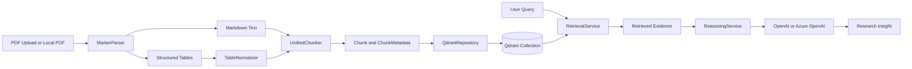
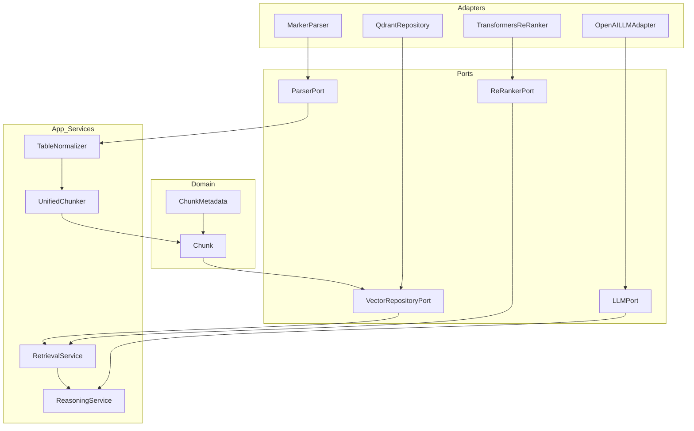

# Medical Research RAG Pipeline

A modular Retrieval-Augmented Generation (RAG) system for medical research PDFs. The current implementation ingests PDFs, extracts narrative text and tables, normalizes tabular artifacts, chunks documents in a structure-aware way, stores chunks in Qdrant, retrieves evidence from the knowledge base, and optionally synthesizes research answers with an LLM.

Current benchmark status:
- retrieval is now tracked on a 26-query benchmark with stricter top-1 and precision metrics
- expected doc hit rate: `1.0`
- expected header hit rate: `1.0`
- top-1 expected doc hit rate: `0.9615`
- top-1 expected header hit rate: `1.0`
- average doc precision: `0.8397`
- average header precision: `0.7692`
- cross-document average doc precision: `0.4792`
- citation noise queries: `1`
- table-hit queries: `5`
- non-structural header queries: `0`
- current retrieval baseline is query-aware section weighting plus single-document metadata suppression
- preserving markdown table placement during parsing improved table retrieval after re-ingestion
- thematic markdown headings for header-poor papers are now normalized back to stable retrieval sections while preserving the original header in metadata
- next benchmark work is broader evaluation coverage plus targeted cross-document precision improvement

## What It Does

- Parses PDFs into Markdown and structured tables using Marker
- Normalizes extracted tables before chunking
- Chunks text and tables differently:
  - text: paragraph-aware sliding windows
  - tables: atomic structural chunks
- Stores chunk embeddings and metadata in Qdrant
- Retrieves evidence from the indexed knowledge base
- Supports optional local re-ranking
- Supports LLM-based research synthesis with OpenAI or Azure OpenAI
- Includes a Streamlit UI for upload, ingestion, retrieval, and research Q&A

## End-to-End Flow



## Architecture

The project follows Hexagonal Architecture (Ports and Adapters). Core logic depends on internal models and explicit contracts, while infrastructure integrations stay isolated behind adapters.



## Project Structure

```text
src/
├─ domain/
│  └─ models/
│     └─ chunk.py
├─ ports/
│  └─ parser_port.py
├─ adapters/
│  └─ parsing/
│     └─ marker_parser.py
└─ app/
   ├─ adapters/
   │  ├─ llm/
   │  │  └─ openai_llm_adapter.py
   │  ├─ rerankers/
   │  │  └─ transformers_reranker.py
   │  └─ vectorstores/
   │     └─ qdrant_repository.py
   ├─ ports/
   │  ├─ llm_port.py
   │  ├─ re_ranker_port.py
   │  └─ repositories/
   │     └─ vector_repository.py
   ├─ prompts/
   │  └─ research_prompt.py
   ├─ services/
   │  ├─ reasoning_service.py
   │  └─ retrieval_service.py
   └─ tables/
      ├─ table_chunker.py
      └─ table_normalizer.py

scripts/
├─ test_single_pdf.py
├─ test_chunk_from_artifacts.py
├─ test_e2e_flow.py
└─ ui_app.py
```

## Core Components

### Parsing

- [marker_parser.py](C:\repos\github\medical-research-rag-pipeline\src\adapters\parsing\marker_parser.py)
- [parser_port.py](C:\repos\github\medical-research-rag-pipeline\src\ports\parser_port.py)

`MarkerParser` converts a PDF into:
- `markdown_text`
- extracted `tables`

Tables are separated from the main text instead of being flattened into plain narrative content.

### Table Processing

- [table_normalizer.py](C:\repos\github\medical-research-rag-pipeline\src\app\tables\table_normalizer.py)
- [table_chunker.py](C:\repos\github\medical-research-rag-pipeline\src\app\tables\table_chunker.py)

`TableNormalizer` trims metadata/title rows from the top of extracted tables and preserves trimmed metadata as an artifact when available.

`UnifiedChunker` processes the document as a whole:
- text is chunked with paragraph-aware sliding windows
- tables remain atomic units with contextual headers

### Retrieval and Re-Ranking

- [retrieval_service.py](C:\repos\github\medical-research-rag-pipeline\src\app\services\retrieval_service.py)
- [vector_repository.py](C:\repos\github\medical-research-rag-pipeline\src\app\ports\repositories\vector_repository.py)
- [qdrant_repository.py](C:\repos\github\medical-research-rag-pipeline\src\app\adapters\vectorstores\qdrant_repository.py)
- [re_ranker_port.py](C:\repos\github\medical-research-rag-pipeline\src\app\ports\re_ranker_port.py)
- [transformers_reranker.py](C:\repos\github\medical-research-rag-pipeline\src\app\adapters\rerankers\transformers_reranker.py)

Retrieval is two-stage:
1. vector search in Qdrant
2. optional cross-encoder re-ranking

The system currently supports collection-wide retrieval across the active knowledge base.

### Reasoning

- [reasoning_service.py](C:\repos\github\medical-research-rag-pipeline\src\app\services\reasoning_service.py)
- [research_prompt.py](C:\repos\github\medical-research-rag-pipeline\src\app\prompts\research_prompt.py)
- [openai_llm_adapter.py](C:\repos\github\medical-research-rag-pipeline\src\app\adapters\llm\openai_llm_adapter.py)

`ReasoningService` builds on retrieved evidence and uses an LLM to synthesize a research answer. The current UI supports both OpenAI and Azure OpenAI.

## Data Model

The central retrieval unit is `Chunk`.

```python
from dataclasses import dataclass, field
from typing import Any, Optional

@dataclass(frozen=True)
class ChunkMetadata:
    doc_id: str
    chunk_type: str
    parent_header: str
    page_number: Optional[int] = None
    extra: dict[str, Any] = field(default_factory=dict)

@dataclass(frozen=True)
class Chunk:
    id: str
    content: str
    metadata: ChunkMetadata
```

Why the nested metadata shape matters:
- it maps cleanly to Qdrant payload fields
- it keeps embedding content separate from filterable attributes
- it makes metadata expansion explicit without changing the retrieval contract

## Runtime Requirements

### Python

- Python 3.11 is the safest target in this repo

### Services

- Qdrant running locally or remotely
- Marker installed for PDF parsing
- OpenAI or Azure OpenAI credentials if using research synthesis

## Installation

Create and activate a virtual environment:

```powershell
py -3.11 -m venv .venv
.\.venv\Scripts\python.exe -m pip install --upgrade pip
```

Install core dependencies:

```powershell
.\.venv\Scripts\python.exe -m pip install pandas pytest qdrant-client streamlit openai
.\.venv\Scripts\python.exe -m pip install torch --index-url https://download.pytorch.org/whl/cpu
.\.venv\Scripts\python.exe -m pip install marker-pdf
```

If you want local re-ranking:

```powershell
.\.venv\Scripts\python.exe -m pip install transformers
```

## Run Qdrant

```powershell
docker run -p 6333:6333 -p 6334:6334 qdrant/qdrant
```

## Run the UI

```powershell
.\.venv\Scripts\python.exe -m streamlit run scripts/ui_app.py
```

The UI supports:
- PDF upload and ingestion
- persistent knowledge-base registry
- evidence retrieval
- optional local re-ranking
- research question answering with OpenAI or Azure OpenAI

## Local Test Commands

Run unit tests:

```powershell
.\.venv\Scripts\python.exe -m pytest -q tests/unit
```

Test parsing on one PDF:

```powershell
.\.venv\Scripts\python.exe scripts/test_single_pdf.py --pdf "data/raw_pdfs/your_file.pdf"
```

Test chunking from generated artifacts:

```powershell
.\.venv\Scripts\python.exe scripts/test_chunk_from_artifacts.py --parsed-dir "data/parsed_debug" --doc-stem "your_file"
```

Run an end-to-end ingestion and retrieval flow:

```powershell
.\.venv\Scripts\python.exe scripts/test_e2e_flow.py --pdf "data/raw_pdfs/your_file.pdf" --query "What does the paper say about lipid biomarkers?" --recreate-collection
```

Run the retrieval evaluation harness against an indexed collection:

```powershell
.\.venv\Scripts\python.exe scripts/evaluate_retrieval.py --collection medical_research_chunks_v1 --dataset data/eval/sample_queries.json --embedding-provider azure_openai --embedding-model "your-embedding-deployment-name"
```

Export stored chunks from Qdrant for validation:

```powershell
.\.venv\Scripts\python.exe scripts/export_qdrant_chunks.py --collection medical_research_chunks_v1 --csv-out data/exports/current_chunks_v1.csv
```

## Current Limitations

- retrieval quality still needs broader evaluation across multiple papers and query types
- cross-document top-1 document selection is still weaker than within-document ranking
- cross-document document precision is still weaker than within-document precision on the 26-query benchmark
- Marker output quality depends on the document layout and OCR quality
- re-ranking uses a local model and may incur first-run download cost
- the persistent knowledge-base registry is a local manifest and can drift from Qdrant if data is changed externally
- evaluation is still based on a small curated benchmark, not a broad corpus-wide test set

## Roadmap

See [ROADMAP.md](C:\github\medical-research-rag-pipeline\ROADMAP.md) for the planned path from current single-document validation to a few-hundred-document corpus, starting with roughly 300 PDFs.
