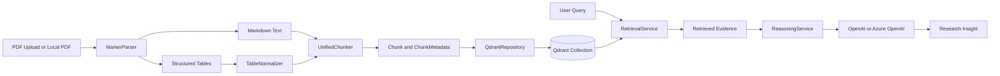
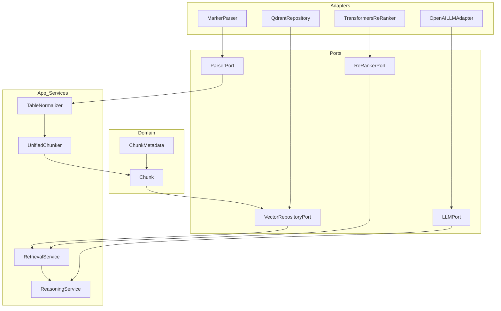

# Medical Research RAG Pipeline

A modular Retrieval-Augmented Generation (RAG) system for medical research PDFs. The current implementation ingests PDFs, extracts narrative text and tables, normalizes tabular artifacts, chunks documents in a structure-aware way, stores chunks in Qdrant, retrieves evidence from the knowledge base, and optionally synthesizes research answers with an LLM.

Current benchmark status:
- retrieval is now tracked on both a stable 26-query benchmark and a broader 43-query expanded benchmark
- the 26-query `data/eval/sample_queries.json` file remains the stable retrieval baseline; `data/eval/expanded_queries.json` extends coverage for stewardship, review-style, title-query, and table-oriented evaluation
- `data/eval/ood_adversarial_queries.json` is now the separate clinician-style and adversarial phrasing track; it is evaluation-only and should not replace the stable baseline or the expanded benchmark
- stable 26-query baseline (`data/eval/sample_queries.json`) from the current March 23, 2026 rerun on `medical_research_chunks_v1`:
  - expected doc hit rate: `1.0`
  - expected header hit rate: `1.0`
  - top-1 expected doc hit rate: `1.0`
  - top-1 expected header hit rate: `1.0`
  - average doc precision: `1.0`
  - average header precision: `1.0`
  - cross-document average doc precision: `1.0`
  - citation noise queries: `1`
  - table-hit queries: `4`
  - non-structural header queries: `0`
- expanded 43-query benchmark (`data/eval/expanded_queries.json`) from the current March 23, 2026 rerun on `medical_research_chunks_v1`:
  - expected doc hit rate: `1.0`
  - expected header hit rate: `1.0`
  - top-1 expected doc hit rate: `1.0`
  - top-1 expected header hit rate: `1.0`
  - average doc precision: `1.0`
  - average header precision: `1.0`
  - cross-document average doc precision: `1.0`
  - citation noise queries: `1`
  - table-hit queries: `6`
  - non-structural header queries: `0`
- the March 23, 2026 rerun now shows perfect stable and expanded benchmark precision on the current corpus after two narrow final-selection suppressions removed residual `Methods`, `Introduction`, and conclusion-tail `Results` noise from doc-filtered queries
- OOD/adversarial benchmark (`data/eval/ood_adversarial_queries.json`) from the current March 23, 2026 rerun on `medical_research_chunks_v1`:
  - expected doc hit rate: `1.0`
  - expected header hit rate: `1.0`
  - top-1 expected doc hit rate: `1.0`
  - top-1 expected header hit rate: `1.0`
  - average doc precision: `1.0`
  - average header precision: `1.0`
  - cross-document average doc precision: `1.0`
  - citation noise queries: `0`
  - table-hit queries: `2`
  - non-structural header queries: `0`
- the March 23, 2026 OOD rerun now resolves the remaining OOD precision cases as well, so the stable, expanded, and OOD tracks all sit at `1.0` doc/header precision on the current collection
- current retrieval baseline is metadata-first filtering in Qdrant plus a smaller query-dependent ranking/diversity layer
- preserving markdown table placement during parsing improved table retrieval after re-ingestion
- thematic markdown headings for header-poor papers are now normalized back to stable retrieval sections while preserving the original header in metadata
- explicit `Table N` references are now preserved in chunk metadata so explicit table queries can recover linked prose evidence when parser output leaves the table callout in narrative text
- table chunks now carry semantic metadata such as metric/comparison flags and lightweight captions to support payload-driven filtering after rebuilds
- returned table chunks now prepend lightweight caption and linked-prose context when metadata establishes a table-prose linkage, improving answer context without adding a new retrieval stage
- metadata-linked table context is no longer limited to literal `Table N` mentions; ingestion can also attach same-section prose when caption/table terminology overlaps strongly enough to support a narrow semantic linkage
- rebuild, UI ingestion, and single-document repair now fail fast on duplicate document identities (`doc_id`, `source_file`, `local_file`) instead of silently creating parallel entries for the same source PDF
- `scripts/audit_collection_state.py` now reports duplicate identity conflicts and can emit a non-destructive cleanup plan before any manual corpus reconciliation work
- `scripts/rebuild_collection.py` now supports batch-oriented `--continue-on-error` operation plus an optional structured failure report so larger rebuilds can retain successful documents while surfacing per-file failures explicitly
- next benchmark work is keeping the stable and expanded records separate while validating that future retrieval or ingestion changes do not regress the now-clean baseline
- hybrid dense+sparse retrieval and ontology-backed query expansion are recognized future options, but they are not the current priority because the present benchmark debt is concentrated in metadata/header quality rather than document-hit recall
- benchmark diversification is now a near-term need: add a separate out-of-distribution evaluation track with clinician-style, journal-club-style, shorthand, and paraphrased queries so retrieval is not tuned only to developer-authored prompt patterns
- the OOD/adversarial track should be run with separate JSON/CSV output paths so its noisier phrasing cases do not overwrite the baseline result artifacts
- current OOD debugging confirmed the stewardship-review miss was not a candidate-recall problem: the Fabre paper was already present in early candidates, and a narrow document-level disambiguation step was enough to resolve `O03` and `O10` without broader ranking changes
- before any further retrieval changes, the repo should diagnose and explain any header-precision or table-hit drift on the stable 26-query and expanded 43-query benchmarks before stacking new behavior on top
- parser experimentation should happen inside this repo as an isolated bakeoff workflow, not as a separate project and not by replacing the active ingestion path prematurely

## What It Does

- Parses PDFs into Markdown and structured tables using Marker
- Normalizes extracted tables before chunking
- Chunks text and tables differently:
  - text: paragraph-aware sliding windows
  - tables: atomic structural chunks
- Stores chunk embeddings and metadata in Qdrant
- Retrieves evidence from the indexed knowledge base
- Supports optional local re-ranking
- Supports LLM-based research synthesis with OpenAI or Azure OpenAI
- Includes a Streamlit UI for upload, ingestion, retrieval, and research Q&A

## End-to-End Flow



## Architecture

The project follows Hexagonal Architecture (Ports and Adapters). Core logic depends on internal models and explicit contracts, while infrastructure integrations stay isolated behind adapters.



## Project Structure

```text
src/
├─ domain/
│  └─ models/
│     └─ chunk.py
├─ ports/
│  └─ parser_port.py
├─ adapters/
│  └─ parsing/
│     └─ marker_parser.py
└─ app/
   ├─ adapters/
   │  ├─ llm/
   │  │  └─ openai_llm_adapter.py
   │  ├─ rerankers/
   │  │  └─ transformers_reranker.py
   │  └─ vectorstores/
   │     └─ qdrant_repository.py
   ├─ ports/
   │  ├─ llm_port.py
   │  ├─ re_ranker_port.py
   │  └─ repositories/
   │     └─ vector_repository.py
   ├─ prompts/
   │  └─ research_prompt.py
   ├─ services/
   │  ├─ reasoning_service.py
   │  └─ retrieval_service.py
   └─ tables/
      ├─ table_chunker.py
      └─ table_normalizer.py

scripts/
├─ test_single_pdf.py
├─ test_chunk_from_artifacts.py
├─ test_e2e_flow.py
└─ ui_app.py
```

## Core Components

### Parsing

- [marker_parser.py](C:\repos\github\medical-research-rag-pipeline\src\adapters\parsing\marker_parser.py)
- [parser_port.py](C:\repos\github\medical-research-rag-pipeline\src\ports\parser_port.py)

`MarkerParser` converts a PDF into:
- `markdown_text`
- extracted `tables`

Tables are separated from the main text instead of being flattened into plain narrative content.

### Table Processing

- [table_normalizer.py](C:\repos\github\medical-research-rag-pipeline\src\app\tables\table_normalizer.py)
- [table_chunker.py](C:\repos\github\medical-research-rag-pipeline\src\app\tables\table_chunker.py)

`TableNormalizer` trims metadata/title rows from the top of extracted tables and preserves trimmed metadata as an artifact when available.

`UnifiedChunker` processes the document as a whole:
- text is chunked with paragraph-aware sliding windows
- tables remain atomic units with contextual headers
- text and table chunks now carry richer retrieval metadata including ingestion/chunking versions, canonical/original headers, local/source file paths, and table semantic flags
- the local knowledge-base registry now hydrates collection document summaries from the rebuild manifest when present, reducing drift between the UI registry and manifest-tracked corpus state
- document ID derivation is now centralized across rebuild, UI ingestion, single-doc repair, and local test scripts; the current filename-stem-based naming style is preserved, but ad hoc per-script drift has been removed

### Retrieval and Re-Ranking

- [retrieval_service.py](C:\repos\github\medical-research-rag-pipeline\src\app\services\retrieval_service.py)
- [vector_repository.py](C:\repos\github\medical-research-rag-pipeline\src\app\ports\repositories\vector_repository.py)
- [qdrant_repository.py](C:\repos\github\medical-research-rag-pipeline\src\app\adapters\vectorstores\qdrant_repository.py)
- [re_ranker_port.py](C:\repos\github\medical-research-rag-pipeline\src\app\ports\re_ranker_port.py)
- [transformers_reranker.py](C:\repos\github\medical-research-rag-pipeline\src\app\adapters\rerankers\transformers_reranker.py)

Retrieval is two-stage:
1. vector search in Qdrant
2. optional cross-encoder re-ranking

The system currently supports collection-wide retrieval across the active knowledge base.

Retrieval policy is split as follows:
- payload/Qdrant filtering handles static eligibility such as references, front matter, low-value chunks, and table-oriented gating
- application ranking keeps only query-dependent logic such as section weighting, document locking, duplicate suppression, and diversity caps
- future retrieval extensions should follow the same rule: add new behavior only when benchmark evidence shows a concrete gap, and prefer explicit metadata/filtering over implicit query branching

### Reasoning

- [reasoning_service.py](C:\repos\github\medical-research-rag-pipeline\src\app\services\reasoning_service.py)
- [research_prompt.py](C:\repos\github\medical-research-rag-pipeline\src\app\prompts\research_prompt.py)
- [openai_llm_adapter.py](C:\repos\github\medical-research-rag-pipeline\src\app\adapters\llm\openai_llm_adapter.py)

`ReasoningService` builds on retrieved evidence and uses an LLM to synthesize a research answer. The current UI supports both OpenAI and Azure OpenAI.

## Data Model

The central retrieval unit is `Chunk`.

```python
from dataclasses import dataclass, field
from typing import Any, Optional

@dataclass(frozen=True)
class ChunkMetadata:
    doc_id: str
    chunk_type: str
    parent_header: str
    page_number: Optional[int] = None
    extra: dict[str, Any] = field(default_factory=dict)

@dataclass(frozen=True)
class Chunk:
    id: str
    content: str
    metadata: ChunkMetadata
```

Why the nested metadata shape matters:
- it maps cleanly to Qdrant payload fields
- it keeps embedding content separate from filterable attributes
- it makes metadata expansion explicit without changing the retrieval contract

## Runtime Requirements

### Python

- Python 3.11 is the safest target in this repo

### Services

- Qdrant running locally or remotely
- Marker installed for PDF parsing
- OpenAI or Azure OpenAI credentials for embeddings
- Optional OpenAI or Azure OpenAI credentials for answer synthesis

## Setup

The checked-in `requirements.txt` and `.env.example` are the base setup surface for this repo.

Important runtime note:
- the repo does not auto-load `.env`
- copying `.env.example` to `.env` is useful as a template, but the values only apply if your shell/session loads them or if you pass the equivalent CLI flags
- the CLI scripts and the Streamlit UI read environment variables via `os.getenv(...)`; they do not call `python-dotenv`
- keep concrete values in `.env`; do not rely on `${OTHER_VAR}` interpolation unless your own shell loader expands it before Python starts

Create a virtual environment and upgrade `pip`:

```powershell
py -3.11 -m venv .venv
.\.venv\Scripts\Activate.ps1
python -m pip install --upgrade pip
```

```bash
python3.11 -m venv .venv
source .venv/bin/activate
python -m pip install --upgrade pip
```

Install the base dependencies:

```powershell
python -m pip install -r requirements.txt
```

```bash
python -m pip install -r requirements.txt
```

Create a local env file from the checked-in template:

```powershell
Copy-Item .env.example .env
```

```bash
cp .env.example .env
```

Load `.env` into your shell if you want the scripts to pick those values up automatically.

PowerShell example:

```powershell
Get-Content .env | Where-Object { $_ -and -not $_.StartsWith('#') } | ForEach-Object {
    $name, $value = $_ -split '=', 2
    Set-Item -Path "Env:$name" -Value $value
}
```

Bash example:

```bash
set -a
source .env
set +a
```

### Required Environment Variables

For embeddings:

- `EMBEDDING_PROVIDER`: `openai` or `azure_openai`
- `EMBEDDING_MODEL`: OpenAI embedding model name or Azure embedding deployment name
- `EMBEDDING_DIMENSIONS`: embedding vector size; set `0` to use provider default when supported
- `EMBEDDING_API_KEY`: required by the retrieval and ingestion scripts unless `OPENAI_API_KEY` is being used as the fallback for OpenAI embeddings

For Azure OpenAI embeddings only:

- `EMBEDDING_AZURE_OPENAI_ENDPOINT` or `AZURE_OPENAI_ENDPOINT`
- `EMBEDDING_AZURE_OPENAI_API_VERSION` or `AZURE_OPENAI_API_VERSION`

PowerShell note:
- if you use the README's PowerShell loader, set `EMBEDDING_AZURE_OPENAI_ENDPOINT` and `EMBEDDING_AZURE_OPENAI_API_VERSION` to explicit values in `.env`
- a line like `EMBEDDING_AZURE_OPENAI_ENDPOINT=${AZURE_OPENAI_ENDPOINT}` will stay literal and break Azure embedding calls

For Qdrant:

- `QDRANT_URL`: documented base URL for your Qdrant instance
- `QDRANT_COLLECTION`: documented default collection name for this repo

Current behavior note:
- the scripts still take Qdrant settings from CLI flags and built-in defaults rather than automatically consuming `QDRANT_URL` or `QDRANT_COLLECTION`
- `scripts/test_e2e_flow.py` and `scripts/ui_app.py` default to `medical_research_chunks`
- the preserved benchmark baseline is on `medical_research_chunks_v1`, so set that collection explicitly when you want to work against the clean retrieval baseline

For optional answer synthesis:

- `OPENAI_API_KEY`: used by the Streamlit UI for answer synthesis by default; also acts as the fallback key for OpenAI embeddings
- `OPENAI_MODEL`: OpenAI chat model name or Azure chat deployment name for answer synthesis
- `AZURE_OPENAI_ENDPOINT`: required for Azure OpenAI answer synthesis
- `AZURE_OPENAI_API_VERSION`: required for Azure OpenAI answer synthesis

### Dependency Notes

- `requirements.txt` is the supported base install
- local re-ranking support is already included there via `transformers`
- the `torch` dependency is pinned to the CPU wheel index in `requirements.txt`

## Run Qdrant

```powershell
docker run --rm -p 6333:6333 -p 6334:6334 qdrant/qdrant
```

```bash
docker run --rm -p 6333:6333 -p 6334:6334 qdrant/qdrant
```

## Run the UI

```powershell
python -m streamlit run scripts/ui_app.py
```

```bash
python -m streamlit run scripts/ui_app.py
```

Before using the UI:
- start Qdrant first
- provide embedding credentials in the sidebar
- if you want to use the preserved benchmark collection, change the sidebar collection from `medical_research_chunks` to `medical_research_chunks_v1`

The UI supports:
- PDF upload and ingestion
- persistent knowledge-base registry
- evidence retrieval
- optional local re-ranking
- research question answering with OpenAI or Azure OpenAI

## Local Test Commands

Run unit tests first:

```powershell
.\.venv\Scripts\python.exe -m pytest -q tests/unit --basetemp .pytest_tmp_run
```

```bash
python -m pytest -q tests/unit --basetemp .pytest_tmp_run
```

Test parsing on one PDF:

```powershell
.\.venv\Scripts\python.exe scripts/test_single_pdf.py --pdf "data/raw_pdfs/your_file.pdf"
```

Test chunking from generated artifacts:

```powershell
.\.venv\Scripts\python.exe scripts/test_chunk_from_artifacts.py --parsed-dir "data/parsed_debug" --doc-stem "your_file"
```

Run an end-to-end ingestion and retrieval flow:

```powershell
.\.venv\Scripts\python.exe scripts/test_e2e_flow.py --pdf "data/raw_pdfs/your_file.pdf" --query "What does the paper say about lipid biomarkers?" --recreate-collection
```

```bash
python scripts/test_e2e_flow.py --pdf "data/raw_pdfs/your_file.pdf" --query "What does the paper say about lipid biomarkers?" --recreate-collection
```

`scripts/test_e2e_flow.py` defaults to the `medical_research_chunks` collection. Pass `--collection medical_research_chunks_v1` only if you intentionally want to point it at the preserved benchmark collection.

Run the retrieval evaluation harness against an indexed collection:

```powershell
.\.venv\Scripts\python.exe scripts/evaluate_retrieval.py --collection medical_research_chunks_v1 --dataset data/eval/sample_queries.json --embedding-provider azure_openai --embedding-model "your-embedding-deployment-name"
```

```bash
python scripts/evaluate_retrieval.py --collection medical_research_chunks_v1 --dataset data/eval/sample_queries.json --embedding-provider azure_openai --embedding-model "your-embedding-deployment-name"
```

When `--json-out` and `--csv-out` are omitted, the stable baseline now writes to `data/eval/results/retrieval_eval_sample.json` and `data/eval/results/retrieval_eval_sample.csv` by default so it does not overwrite broader benchmark runs.

Run the expanded benchmark without changing the stable baseline dataset:

```powershell
.\.venv\Scripts\python.exe scripts/evaluate_retrieval.py --collection medical_research_chunks_v1 --dataset data/eval/expanded_queries.json --embedding-provider azure_openai --embedding-model "your-embedding-deployment-name"
```

```bash
python scripts/evaluate_retrieval.py --collection medical_research_chunks_v1 --dataset data/eval/expanded_queries.json --embedding-provider azure_openai --embedding-model "your-embedding-deployment-name"
```

The expanded benchmark now defaults to `data/eval/results/retrieval_eval_expanded.json` and `data/eval/results/retrieval_eval_expanded.csv`, keeping the stable and expanded records separate unless you explicitly override the paths.

Run the separate OOD/adversarial phrasing track with its own result files:

```powershell
.\.venv\Scripts\python.exe scripts/evaluate_retrieval.py --collection medical_research_chunks_v1 --dataset data/eval/ood_adversarial_queries.json --embedding-provider azure_openai --embedding-model "your-embedding-deployment-name" --json-out data/eval/results/ood_retrieval_eval.json --csv-out data/eval/results/ood_retrieval_eval.csv
```

```bash
python scripts/evaluate_retrieval.py --collection medical_research_chunks_v1 --dataset data/eval/ood_adversarial_queries.json --embedding-provider azure_openai --embedding-model "your-embedding-deployment-name" --json-out data/eval/results/ood_retrieval_eval.json --csv-out data/eval/results/ood_retrieval_eval.csv
```

Inspect one OOD query across retrieval stages before changing ranking logic:

```powershell
.\.venv\Scripts\python.exe scripts/inspect_retrieval_candidates.py --query-id O03 --dataset data/eval/ood_adversarial_queries.json --collection medical_research_chunks_v1 --embedding-provider azure_openai --embedding-model "your-embedding-deployment-name"
```

```bash
python scripts/inspect_retrieval_candidates.py --query-id O03 --dataset data/eval/ood_adversarial_queries.json --collection medical_research_chunks_v1 --embedding-provider azure_openai --embedding-model "your-embedding-deployment-name"
```

Deterministically rebuild a collection from the uploaded benchmark PDFs:

```powershell
.\.venv\Scripts\python.exe scripts/rebuild_collection.py --pdf-dir data/raw_pdfs/uploaded --collection medical_research_chunks_v1 --embedding-provider azure_openai --embedding-model "your-embedding-deployment-name"
```

If you want a medium-scale batch rebuild to continue past per-file failures while still recording them for follow-up:

```powershell
.\.venv\Scripts\python.exe scripts/rebuild_collection.py --pdf-dir data/raw_pdfs/uploaded --collection medical_research_chunks_v1 --embedding-provider azure_openai --embedding-model "your-embedding-deployment-name" --continue-on-error --failure-report-out data/eval/results/rebuild_failures_medical_research_chunks_v1.json
```

If `--manifest-out` is omitted, rebuilds now default to `data/ingestion_manifests/<collection>_rebuild_manifest.json`, which keeps the rebuild output aligned with the default audit and reingest workflow for the same collection. With `--continue-on-error`, successful documents are still written into the rebuilt collection and manifest, the JSON failure report captures per-file errors, and the command still exits with code `1` if any failures occurred so automation can flag the batch for follow-up. If `--failure-report-out` is omitted, the report now defaults to `data/eval/results/rebuild_failures_<collection>.json`.

Reparse and replace a single document in an existing collection, optionally syncing the rebuild manifest entry at the same time:

```powershell
.\.venv\Scripts\python.exe scripts/reingest_single_doc.py --doc-id "your-doc-id" --pdf "data/raw_pdfs/uploaded/your_file.pdf" --collection medical_research_chunks_v1 --embedding-provider azure_openai --embedding-model "your-embedding-deployment-name" --manifest data/ingestion_manifests/medical_research_chunks_v1_rebuild_manifest.json
```

If you want a structured failure record for a repair attempt:

```powershell
.\.venv\Scripts\python.exe scripts/reingest_single_doc.py --doc-id "your-doc-id" --pdf "data/raw_pdfs/uploaded/your_file.pdf" --collection medical_research_chunks_v1 --embedding-provider azure_openai --embedding-model "your-embedding-deployment-name" --manifest data/ingestion_manifests/medical_research_chunks_v1_rebuild_manifest.json --failure-report-out data/eval/results/reingest_failure_your_doc_id.json
```

The single-document repair flow now writes stage-specific failure context, covering malformed manifest JSON and other manifest-validation failures, embedding preflight, parse, chunk, delete, upsert, and manifest-update failures. If `--failure-report-out` is omitted, the report now defaults to `data/eval/results/reingest_failure_<collection>_<doc_id>.json`.

Export stored chunks from Qdrant for validation:

```powershell
.\.venv\Scripts\python.exe scripts/export_qdrant_chunks.py --collection medical_research_chunks_v1 --csv-out data/exports/current_chunks_v1.csv
```

Audit one collection across Qdrant, the rebuild manifest, and the local registry, and optionally sync the registry from the manifest before reporting:

```powershell
.\.venv\Scripts\python.exe scripts/audit_collection_state.py --collection medical_research_chunks_v1 --sync-registry --json-out data/eval/results/collection_audit_medical_research_chunks_v1.json
```

Write a non-destructive duplicate cleanup plan from the same audit metadata without changing the collection:

```powershell
.\.venv\Scripts\python.exe scripts/audit_collection_state.py --collection medical_research_chunks_v1 --cleanup-plan-out data/eval/results/collection_cleanup_plan.json
```

Use the audit as an explicit rollout gate for Phase 5 or any medium-scale ingest batch:

```powershell
.\.venv\Scripts\python.exe scripts/audit_collection_state.py --collection medical_research_chunks_v1 --sync-registry --json-out data/eval/results/collection_audit_medical_research_chunks_v1.json --cleanup-plan-out data/eval/results/collection_cleanup_plan.json --fail-on-issues
```

Manifest-aware repair paths now enforce collection and ingestion/chunking version compatibility before updating local records, so a stale or mismatched manifest fails fast instead of being silently reused.
The audit path now also fails fast on malformed manifest JSON instead of crashing during load, and it surfaces duplicate `doc_id`, `source_file`, and `local_file` conflicts explicitly; if the cleanup plan is empty, Qdrant, manifest, and registry agree on document identity at the metadata level. With `--fail-on-issues`, the command returns exit code `1` for any manifest version issue, reconciliation issue, or cleanup-plan step.

## Recommended Batch Workflow

For medium-scale ingestion work, the current operator path is:

1. Rebuild the collection with manifest output:

```powershell
.\.venv\Scripts\python.exe scripts/rebuild_collection.py --pdf-dir data/raw_pdfs/uploaded --collection medical_research_chunks_v1 --embedding-provider azure_openai --embedding-model "your-embedding-deployment-name" --continue-on-error
```

2. Review any rebuild failures written to `data/eval/results/rebuild_failures_medical_research_chunks_v1.json`.

3. Repair individual documents as needed:

```powershell
.\.venv\Scripts\python.exe scripts/reingest_single_doc.py --doc-id "your-doc-id" --pdf "data/raw_pdfs/uploaded/your_file.pdf" --collection medical_research_chunks_v1 --embedding-provider azure_openai --embedding-model "your-embedding-deployment-name" --manifest data/ingestion_manifests/medical_research_chunks_v1_rebuild_manifest.json
```

4. Review any single-document repair failures under `data/eval/results/reingest_failure_<collection>_<doc_id>.json`.

5. Run the audit gate before treating the collection as rollout-ready:

```powershell
.\.venv\Scripts\python.exe scripts/audit_collection_state.py --collection medical_research_chunks_v1 --sync-registry --json-out data/eval/results/collection_audit_medical_research_chunks_v1.json --cleanup-plan-out data/eval/results/collection_cleanup_plan.json --fail-on-issues
```

This keeps the current operational loop explicit: rebuild, inspect failures, repair specific documents, then run the audit gate before larger rollout work.

## Parser Bakeoff Guidance

If parser comparison work starts, keep it inside this repo and isolate it from the active ingestion path:
- treat parser bakeoff work as an experiment, not a production parser swap
- prefer a separate script or `experiments/` workflow over changes to the primary parser path
- use separate output folders and separate Qdrant collection names for parser comparisons
- do not run parser bakeoff ingestion jobs against the active collection while a rebuild/re-ingestion is already running
- compare candidate parsers on the same fixed PDF subset and evaluate downstream retrieval, not just parsing aesthetics

Recommended evaluation dimensions:
- header quality
- table extraction fidelity
- caption or linked-prose recovery
- downstream retrieval metrics on the existing benchmark sets

Current parser planning note:
- `Docling` is the more plausible structural parsing experiment than `pymupdf4llm`
- if `Docling` wins clearly, prefer `Docling` alone over a permanent `Marker + Docling` blended pipeline unless a combined approach has a deterministic, benchmark-backed merge strategy
- parser bakeoff should happen before large Phase 5 corpus rollout work; discovering a better parser after ingesting hundreds of PDFs would force an avoidable large-scale re-ingestion

Isolated parser bakeoff tooling now exists:
- `experiments/parser_bakeoff.py` can run `Marker`, `Docling`, or both against a fixed PDF subset
- parser artifacts are written under `data/parser_bakeoff/artifacts/<parser>/...`
- parser summaries and comparison output are written under `data/parser_bakeoff/results/...`
- bakeoff ingestion uses separate parser-specific collection names and does not touch `medical_research_chunks_v1`
- `Docling` remains an optional experiment-only dependency; the checked-in `requirements.txt` is still the base production setup surface for this repo

Parse-only example for initial artifact inspection:

```powershell
.\.venv\Scripts\python.exe experiments/parser_bakeoff.py --pdf-dir data/parser_bakeoff/input_subset --parser both --parse-only
```

If you later want isolated ingestion plus evaluation into parser-specific collections:

```powershell
.\.venv\Scripts\python.exe experiments/parser_bakeoff.py --pdf-dir data/parser_bakeoff/input_subset --parser both --marker-collection medical_research_chunks_marker_bakeoff --docling-collection medical_research_chunks_docling_bakeoff --recreate-collections --run-eval --embedding-provider azure_openai --embedding-model "your-embedding-deployment-name"
```

Current parser bakeoff note from the March 25, 2026 8-PDF subset run:
- `Docling` is now operational in the isolated bakeoff path after adapting `TableItem.export_to_dataframe()` into the repo's `ParsedTable` contract
- the `Docling` adapter now also applies a narrow markdown cleanup pass before chunking to strip `<!-- image -->` fragments, collapse repeated opening boilerplate, and reduce obvious spacing/OCR artifacts exposed by the first bakeoff diagnostics
- the `Docling` adapter now also normalizes opening structured-abstract blocks into an explicit `Structured Abstract` header before the real article body, reducing how aggressively top-of-paper summary prose competes with body sections during retrieval
- the isolated `Docling` bakeoff parser now also strips inline numeric citation runs such as `[21]` or `[5, 6, 9, 11-14]` before chunking, based on regression diagnosis showing citation-noise hits were still coming from otherwise-eligible body chunks rather than retrieval-stage reference chunks
- the isolated `Docling` bakeoff parser now also recovers the pathological Culture-Free LOD table from page text and links table chunks to shorter table-led context snippets so duplicate prose does not crowd those tables out during final selection
- parse and ingest completed for all 8 subset PDFs in both parser-specific bakeoff collections
- despite better-looking parser artifacts in spot checks, the first downstream retrieval comparison does not justify a production switch yet
- on the current 8-PDF subset, the current isolated `Docling` summary is `2781` chunks total, `2751` text chunks, and `30` table chunks
- citation-noise regressions are now fixed in the isolated `Docling` path
- the stable and expanded regression set has narrowed to `Q19` only; `Q05` and `Q18` now match or exceed the `Marker` baseline on table hits
- the remaining `Q19` miss is no longer the Culture-Free LOD table path; current diagnosis indicates a cross-document selection/ranking issue where duplicate `smith-et-al-2023-comparison-of-three-rapid-diagnostic-tests-for-bloodstream-infections-using-benefit-risk-evaluation` evidence still displaces an additional expected table-bearing document
- the current recommendation is to keep `Marker` as production and treat `Docling` as an isolated parser experiment until those regressions are explained

For deeper `Docling` diagnosis, compare query-level regressions directly before changing parser or retrieval logic:

```powershell
.\.venv\Scripts\python.exe experiments/compare_parser_bakeoff_results.py --baseline data/parser_bakeoff/results/marker/ood_adversarial_queries.json --candidate data/parser_bakeoff/results/docling/ood_adversarial_queries.json --json-out data/parser_bakeoff/results/comparisons/ood_regressions_docling_vs_marker.json
```

Use the same comparison helper on the stable and expanded result files as needed. The recommended workflow is:
- identify the exact regressed query IDs first
- inspect those queries with `scripts/inspect_retrieval_candidates.py` against `medical_research_chunks_docling_bakeoff`
- compare the matching `Marker` and `Docling` artifacts for the implicated documents
- keep any follow-up changes parser-side and narrow until the regression source is clear

## Current Limitations

- retrieval quality still needs broader evaluation across multiple papers and query types
- benchmark quality still depends on manual expectation refinement as cross-document and table-oriented cases are added
- Marker output quality depends on the document layout and OCR quality
- re-ranking uses a local model and may incur first-run download cost
- the persistent knowledge-base registry is still a local file and can drift from Qdrant if data is changed externally, although manifest sync, duplicate guards, and the collection audit/cleanup-plan workflow now make that drift explicit and reviewable
- evaluation is still based on a curated benchmark, not a broad corpus-wide test set
- header-quality metrics still contain real ambiguity because some valid evidence is returned from adjacent sections such as `Introduction`, `Methods`, or normalized opening metadata
- sparse/hybrid retrieval is not implemented yet; this is a deliberate deferral until benchmark evidence shows lexical recall failures that metadata-first filtering cannot address cleanly
- ontology-backed query expansion is not implemented yet; this is also deferred until failing queries show real abbreviation/synonym mismatch that justifies the added query-policy complexity
- table context is now attached through caption and linked-prose metadata when available, including narrow same-section semantic linkage added during ingestion, but coverage still depends on usable caption/table terminology being present in parser output
- the current benchmark is still curated in-house, so it may underrepresent clinician-style or adversarial phrasing unless a separate OOD evaluation track is maintained
- the OOD/adversarial dataset is intentionally a separate track; review or correct its expectations manually before using it to justify retrieval changes
- current OOD debugging has already corrected one expectation-level ambiguity (`O07`), so remaining misses should be treated as retrieval behavior only after candidate inspection confirms the expected document is not already present upstream
- the current recommended order is: keep the stable and expanded benchmark records separate, diagnose any precision/table regressions, then only add further retrieval behavior if those measured regressions require it; do not add extra retrieval stages such as hybrid search, query expansion, or extra embedding-based routing before that work is complete
- parser bakeoff tooling is implemented and should remain isolated from the active collection; any parser migration should still be justified by downstream retrieval gains on the benchmark, not just cleaner-looking parsed output

## Roadmap

See [ROADMAP.md](C:\github\medical-research-rag-pipeline\ROADMAP.md) for the planned path from current single-document validation to a few-hundred-document corpus, starting with roughly 300 PDFs.
