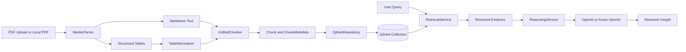
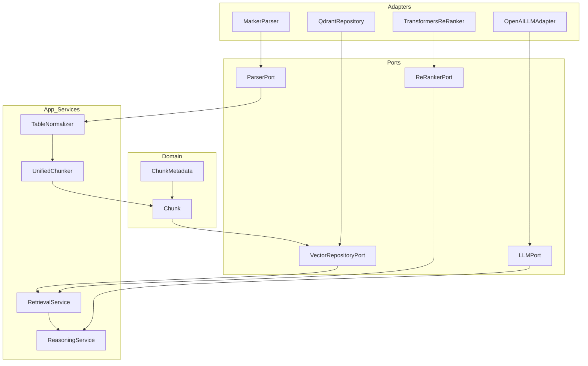

# Medical Research RAG Pipeline

A modular Retrieval-Augmented Generation (RAG) system for medical research PDFs. The current implementation ingests PDFs, extracts narrative text and tables, normalizes tabular artifacts, chunks documents in a structure-aware way, stores chunks in Qdrant, retrieves evidence from the knowledge base, and optionally synthesizes research answers with an LLM.

Current benchmark status:
- retrieval is now tracked on both a stable 26-query benchmark and a broader 43-query expanded benchmark
- the 26-query `data/eval/sample_queries.json` file remains the stable retrieval baseline; `data/eval/expanded_queries.json` extends coverage for stewardship, review-style, title-query, and table-oriented evaluation
- `data/eval/ood_adversarial_queries.json` is now the separate clinician-style and adversarial phrasing track; it is evaluation-only and should not replace the stable baseline or the expanded benchmark
- stable 26-query baseline (`data/eval/sample_queries.json`) from the current March 23, 2026 rerun on `medical_research_chunks_v1`:
  - expected doc hit rate: `1.0`
  - expected header hit rate: `1.0`
  - top-1 expected doc hit rate: `1.0`
  - top-1 expected header hit rate: `1.0`
  - average doc precision: `1.0`
  - average header precision: `0.9462`
  - cross-document average doc precision: `1.0`
  - citation noise queries: `1`
  - table-hit queries: `4`
  - non-structural header queries: `0`
- expanded 43-query benchmark (`data/eval/expanded_queries.json`) from the current March 23, 2026 rerun on `medical_research_chunks_v1`:
  - expected doc hit rate: `1.0`
  - expected header hit rate: `1.0`
  - top-1 expected doc hit rate: `1.0`
  - top-1 expected header hit rate: `1.0`
  - average doc precision: `1.0`
  - average header precision: `0.9628`
  - cross-document average doc precision: `1.0`
  - citation noise queries: `1`
  - table-hit queries: `6`
  - non-structural header queries: `0`
- the March 23, 2026 rerun preserved perfect expected doc/header hit rates while modestly improving header precision after benchmark expectation cleanup plus a narrow cross-document metadata suppression fix
- the latest expectation-only cleanup raised average header precision to `0.9462` on the stable benchmark and `0.9628` on the expanded benchmark without changing retrieval logic; the remaining header debt is now concentrated in explicit ranking-noise cases such as `Q03`, `Q07`, `Q09`, `Q10`, `Q26`, and expanded-only `Q32`
- the March 20, 2026 OOD reruns now resolve the previously stubborn singular contrastive stewardship-review queries, so `O03` and `O10` both return the Fabre stewardship review in top-1 after the narrow document-level disambiguation step
- current retrieval baseline is metadata-first filtering in Qdrant plus a smaller query-dependent ranking/diversity layer
- preserving markdown table placement during parsing improved table retrieval after re-ingestion
- thematic markdown headings for header-poor papers are now normalized back to stable retrieval sections while preserving the original header in metadata
- explicit `Table N` references are now preserved in chunk metadata so explicit table queries can recover linked prose evidence when parser output leaves the table callout in narrative text
- table chunks now carry semantic metadata such as metric/comparison flags and lightweight captions to support payload-driven filtering after rebuilds
- rebuild, UI ingestion, and single-document repair now fail fast on duplicate document identities (`doc_id`, `source_file`, `local_file`) instead of silently creating parallel entries for the same source PDF
- `scripts/audit_collection_state.py` now reports duplicate identity conflicts and can emit a non-destructive cleanup plan before any manual corpus reconciliation work
- next benchmark work is finishing expectation cleanup on the remaining explicit ranking-debt queries, especially `Q15`, before any further retrieval logic is considered
- hybrid dense+sparse retrieval and ontology-backed query expansion are recognized future options, but they are not the current priority because the present benchmark debt is concentrated in metadata/header quality rather than document-hit recall
- benchmark diversification is now a near-term need: add a separate out-of-distribution evaluation track with clinician-style, journal-club-style, shorthand, and paraphrased queries so retrieval is not tuned only to developer-authored prompt patterns
- the OOD/adversarial track should be run with separate JSON/CSV output paths so its noisier phrasing cases do not overwrite the baseline result artifacts
- current OOD debugging confirmed the stewardship-review miss was not a candidate-recall problem: the Fabre paper was already present in early candidates, and a narrow document-level disambiguation step was enough to resolve `O03` and `O10` without broader ranking changes
- before any further retrieval changes, the repo should diagnose and explain any header-precision or table-hit drift on the stable 26-query and expanded 43-query benchmarks before stacking new behavior on top
- parser experimentation should happen inside this repo as an isolated bakeoff workflow, not as a separate project and not by replacing the active ingestion path prematurely

## What It Does

- Parses PDFs into Markdown and structured tables using Marker
- Normalizes extracted tables before chunking
- Chunks text and tables differently:
  - text: paragraph-aware sliding windows
  - tables: atomic structural chunks
- Stores chunk embeddings and metadata in Qdrant
- Retrieves evidence from the indexed knowledge base
- Supports optional local re-ranking
- Supports LLM-based research synthesis with OpenAI or Azure OpenAI
- Includes a Streamlit UI for upload, ingestion, retrieval, and research Q&A

## End-to-End Flow



## Architecture

The project follows Hexagonal Architecture (Ports and Adapters). Core logic depends on internal models and explicit contracts, while infrastructure integrations stay isolated behind adapters.



## Project Structure

```text
src/
├─ domain/
│  └─ models/
│     └─ chunk.py
├─ ports/
│  └─ parser_port.py
├─ adapters/
│  └─ parsing/
│     └─ marker_parser.py
└─ app/
   ├─ adapters/
   │  ├─ llm/
   │  │  └─ openai_llm_adapter.py
   │  ├─ rerankers/
   │  │  └─ transformers_reranker.py
   │  └─ vectorstores/
   │     └─ qdrant_repository.py
   ├─ ports/
   │  ├─ llm_port.py
   │  ├─ re_ranker_port.py
   │  └─ repositories/
   │     └─ vector_repository.py
   ├─ prompts/
   │  └─ research_prompt.py
   ├─ services/
   │  ├─ reasoning_service.py
   │  └─ retrieval_service.py
   └─ tables/
      ├─ table_chunker.py
      └─ table_normalizer.py

scripts/
├─ test_single_pdf.py
├─ test_chunk_from_artifacts.py
├─ test_e2e_flow.py
└─ ui_app.py
```

## Core Components

### Parsing

- [marker_parser.py](C:\repos\github\medical-research-rag-pipeline\src\adapters\parsing\marker_parser.py)
- [parser_port.py](C:\repos\github\medical-research-rag-pipeline\src\ports\parser_port.py)

`MarkerParser` converts a PDF into:
- `markdown_text`
- extracted `tables`

Tables are separated from the main text instead of being flattened into plain narrative content.

### Table Processing

- [table_normalizer.py](C:\repos\github\medical-research-rag-pipeline\src\app\tables\table_normalizer.py)
- [table_chunker.py](C:\repos\github\medical-research-rag-pipeline\src\app\tables\table_chunker.py)

`TableNormalizer` trims metadata/title rows from the top of extracted tables and preserves trimmed metadata as an artifact when available.

`UnifiedChunker` processes the document as a whole:
- text is chunked with paragraph-aware sliding windows
- tables remain atomic units with contextual headers
- text and table chunks now carry richer retrieval metadata including ingestion/chunking versions, canonical/original headers, local/source file paths, and table semantic flags
- the local knowledge-base registry now hydrates collection document summaries from the rebuild manifest when present, reducing drift between the UI registry and manifest-tracked corpus state
- document ID derivation is now centralized across rebuild, UI ingestion, single-doc repair, and local test scripts; the current filename-stem-based naming style is preserved, but ad hoc per-script drift has been removed

### Retrieval and Re-Ranking

- [retrieval_service.py](C:\repos\github\medical-research-rag-pipeline\src\app\services\retrieval_service.py)
- [vector_repository.py](C:\repos\github\medical-research-rag-pipeline\src\app\ports\repositories\vector_repository.py)
- [qdrant_repository.py](C:\repos\github\medical-research-rag-pipeline\src\app\adapters\vectorstores\qdrant_repository.py)
- [re_ranker_port.py](C:\repos\github\medical-research-rag-pipeline\src\app\ports\re_ranker_port.py)
- [transformers_reranker.py](C:\repos\github\medical-research-rag-pipeline\src\app\adapters\rerankers\transformers_reranker.py)

Retrieval is two-stage:
1. vector search in Qdrant
2. optional cross-encoder re-ranking

The system currently supports collection-wide retrieval across the active knowledge base.

Retrieval policy is split as follows:
- payload/Qdrant filtering handles static eligibility such as references, front matter, low-value chunks, and table-oriented gating
- application ranking keeps only query-dependent logic such as section weighting, document locking, duplicate suppression, and diversity caps
- future retrieval extensions should follow the same rule: add new behavior only when benchmark evidence shows a concrete gap, and prefer explicit metadata/filtering over implicit query branching

### Reasoning

- [reasoning_service.py](C:\repos\github\medical-research-rag-pipeline\src\app\services\reasoning_service.py)
- [research_prompt.py](C:\repos\github\medical-research-rag-pipeline\src\app\prompts\research_prompt.py)
- [openai_llm_adapter.py](C:\repos\github\medical-research-rag-pipeline\src\app\adapters\llm\openai_llm_adapter.py)

`ReasoningService` builds on retrieved evidence and uses an LLM to synthesize a research answer. The current UI supports both OpenAI and Azure OpenAI.

## Data Model

The central retrieval unit is `Chunk`.

```python
from dataclasses import dataclass, field
from typing import Any, Optional

@dataclass(frozen=True)
class ChunkMetadata:
    doc_id: str
    chunk_type: str
    parent_header: str
    page_number: Optional[int] = None
    extra: dict[str, Any] = field(default_factory=dict)

@dataclass(frozen=True)
class Chunk:
    id: str
    content: str
    metadata: ChunkMetadata
```

Why the nested metadata shape matters:
- it maps cleanly to Qdrant payload fields
- it keeps embedding content separate from filterable attributes
- it makes metadata expansion explicit without changing the retrieval contract

## Runtime Requirements

### Python

- Python 3.11 is the safest target in this repo

### Services

- Qdrant running locally or remotely
- Marker installed for PDF parsing
- OpenAI or Azure OpenAI credentials if using research synthesis

## Installation

Create and activate a virtual environment:

```powershell
py -3.11 -m venv .venv
.\.venv\Scripts\python.exe -m pip install --upgrade pip
```

Install core dependencies:

```powershell
.\.venv\Scripts\python.exe -m pip install pandas pytest qdrant-client streamlit openai
.\.venv\Scripts\python.exe -m pip install torch --index-url https://download.pytorch.org/whl/cpu
.\.venv\Scripts\python.exe -m pip install marker-pdf
```

Repo setup hardening is still incomplete:
- a checked-in `requirements.txt` or equivalent lock/install file is still needed
- a `.env.example` file is still needed for OpenAI/Azure/Qdrant configuration
- install guidance is still written mainly for PowerShell and should be complemented with clearer cross-platform setup notes before wider rollout

If you want local re-ranking:

```powershell
.\.venv\Scripts\python.exe -m pip install transformers
```

## Run Qdrant

```powershell
docker run -p 6333:6333 -p 6334:6334 qdrant/qdrant
```

## Run the UI

```powershell
.\.venv\Scripts\python.exe -m streamlit run scripts/ui_app.py
```

The UI supports:
- PDF upload and ingestion
- persistent knowledge-base registry
- evidence retrieval
- optional local re-ranking
- research question answering with OpenAI or Azure OpenAI

## Local Test Commands

Run unit tests:

```powershell
.\.venv\Scripts\python.exe -m pytest -q tests/unit
```

Test parsing on one PDF:

```powershell
.\.venv\Scripts\python.exe scripts/test_single_pdf.py --pdf "data/raw_pdfs/your_file.pdf"
```

Test chunking from generated artifacts:

```powershell
.\.venv\Scripts\python.exe scripts/test_chunk_from_artifacts.py --parsed-dir "data/parsed_debug" --doc-stem "your_file"
```

Run an end-to-end ingestion and retrieval flow:

```powershell
.\.venv\Scripts\python.exe scripts/test_e2e_flow.py --pdf "data/raw_pdfs/your_file.pdf" --query "What does the paper say about lipid biomarkers?" --recreate-collection
```

Run the retrieval evaluation harness against an indexed collection:

```powershell
.\.venv\Scripts\python.exe scripts/evaluate_retrieval.py --collection medical_research_chunks_v1 --dataset data/eval/sample_queries.json --embedding-provider azure_openai --embedding-model "your-embedding-deployment-name"
```

When `--json-out` and `--csv-out` are omitted, the stable baseline now writes to `data/eval/results/retrieval_eval_sample.json` and `data/eval/results/retrieval_eval_sample.csv` by default so it does not overwrite broader benchmark runs.

Run the expanded benchmark without changing the stable baseline dataset:

```powershell
.\.venv\Scripts\python.exe scripts/evaluate_retrieval.py --collection medical_research_chunks_v1 --dataset data/eval/expanded_queries.json --embedding-provider azure_openai --embedding-model "your-embedding-deployment-name"
```

The expanded benchmark now defaults to `data/eval/results/retrieval_eval_expanded.json` and `data/eval/results/retrieval_eval_expanded.csv`, keeping the stable and expanded records separate unless you explicitly override the paths.

Run the separate OOD/adversarial phrasing track with its own result files:

```powershell
.\.venv\Scripts\python.exe scripts/evaluate_retrieval.py --collection medical_research_chunks_v1 --dataset data/eval/ood_adversarial_queries.json --embedding-provider azure_openai --embedding-model "your-embedding-deployment-name" --json-out data/eval/results/ood_retrieval_eval.json --csv-out data/eval/results/ood_retrieval_eval.csv
```

Inspect one OOD query across retrieval stages before changing ranking logic:

```powershell
.\.venv\Scripts\python.exe scripts/inspect_retrieval_candidates.py --query-id O03 --dataset data/eval/ood_adversarial_queries.json --collection medical_research_chunks_v1 --embedding-provider azure_openai --embedding-model "your-embedding-deployment-name"
```

Deterministically rebuild a collection from the uploaded benchmark PDFs:

```powershell
.\.venv\Scripts\python.exe scripts/rebuild_collection.py --pdf-dir data/raw_pdfs/uploaded --collection medical_research_chunks_v1 --embedding-provider azure_openai --embedding-model "your-embedding-deployment-name" --manifest-out data/ingestion_manifests/medical_research_chunks_v1_rebuild_manifest.json
```

Reparse and replace a single document in an existing collection, optionally syncing the rebuild manifest entry at the same time:

```powershell
.\.venv\Scripts\python.exe scripts/reingest_single_doc.py --doc-id "your-doc-id" --pdf "data/raw_pdfs/uploaded/your_file.pdf" --collection medical_research_chunks_v1 --embedding-provider azure_openai --embedding-model "your-embedding-deployment-name" --manifest data/ingestion_manifests/medical_research_chunks_v1_rebuild_manifest.json
```

Export stored chunks from Qdrant for validation:

```powershell
.\.venv\Scripts\python.exe scripts/export_qdrant_chunks.py --collection medical_research_chunks_v1 --csv-out data/exports/current_chunks_v1.csv
```

Audit one collection across Qdrant, the rebuild manifest, and the local registry, and optionally sync the registry from the manifest before reporting:

```powershell
.\.venv\Scripts\python.exe scripts/audit_collection_state.py --collection medical_research_chunks_v1 --sync-registry --json-out data/eval/results/collection_audit_medical_research_chunks_v1.json
```

Write a non-destructive duplicate cleanup plan from the same audit metadata without changing the collection:

```powershell
.\.venv\Scripts\python.exe scripts/audit_collection_state.py --collection medical_research_chunks_v1 --cleanup-plan-out data/eval/results/collection_cleanup_plan.json
```

Use the audit as an explicit rollout gate for Phase 5 or any medium-scale ingest batch:

```powershell
.\.venv\Scripts\python.exe scripts/audit_collection_state.py --collection medical_research_chunks_v1 --sync-registry --json-out data/eval/results/collection_audit_medical_research_chunks_v1.json --cleanup-plan-out data/eval/results/collection_cleanup_plan.json --fail-on-issues
```

Manifest-aware repair paths now enforce collection and ingestion/chunking version compatibility before updating local records, so a stale or mismatched manifest fails fast instead of being silently reused.
The same audit path now surfaces duplicate `doc_id`, `source_file`, and `local_file` conflicts explicitly; if the cleanup plan is empty, Qdrant, manifest, and registry agree on document identity at the metadata level. With `--fail-on-issues`, the command returns exit code `1` for any manifest version issue, reconciliation issue, or cleanup-plan step.

## Parser Bakeoff Guidance

If parser comparison work starts, keep it inside this repo and isolate it from the active ingestion path:
- treat parser bakeoff work as an experiment, not a production parser swap
- prefer a separate script or `experiments/` workflow over changes to the primary parser path
- use separate output folders and separate Qdrant collection names for parser comparisons
- do not run parser bakeoff ingestion jobs against the active collection while a rebuild/re-ingestion is already running
- compare candidate parsers on the same fixed PDF subset and evaluate downstream retrieval, not just parsing aesthetics

Recommended evaluation dimensions:
- header quality
- table extraction fidelity
- caption or linked-prose recovery
- downstream retrieval metrics on the existing benchmark sets

Current parser planning note:
- `Docling` is the more plausible structural parsing experiment than `pymupdf4llm`
- if `Docling` wins clearly, prefer `Docling` alone over a permanent `Marker + Docling` blended pipeline unless a combined approach has a deterministic, benchmark-backed merge strategy
- parser bakeoff should happen before large Phase 5 corpus rollout work; discovering a better parser after ingesting hundreds of PDFs would force an avoidable large-scale re-ingestion

## Current Limitations

- retrieval quality still needs broader evaluation across multiple papers and query types
- benchmark quality still depends on manual expectation refinement as cross-document and table-oriented cases are added
- Marker output quality depends on the document layout and OCR quality
- re-ranking uses a local model and may incur first-run download cost
- the persistent knowledge-base registry is still a local file and can drift from Qdrant if data is changed externally, although manifest sync, duplicate guards, and the collection audit/cleanup-plan workflow now make that drift explicit and reviewable
- evaluation is still based on a curated benchmark, not a broad corpus-wide test set
- header-quality metrics still contain real ambiguity because some valid evidence is returned from adjacent sections such as `Introduction`, `Methods`, or normalized opening metadata
- sparse/hybrid retrieval is not implemented yet; this is a deliberate deferral until benchmark evidence shows lexical recall failures that metadata-first filtering cannot address cleanly
- ontology-backed query expansion is not implemented yet; this is also deferred until failing queries show real abbreviation/synonym mismatch that justifies the added query-policy complexity
- table retrieval does not yet attach caption/prose context automatically to every returned table chunk; the preferred next path is metadata-linked table context, not a generic "previous paragraph" heuristic
- the current benchmark is still curated in-house, so it may underrepresent clinician-style or adversarial phrasing unless a separate OOD evaluation track is maintained
- the OOD/adversarial dataset is intentionally a separate track; review or correct its expectations manually before using it to justify retrieval changes
- current OOD debugging has already corrected one expectation-level ambiguity (`O07`), so remaining misses should be treated as retrieval behavior only after candidate inspection confirms the expected document is not already present upstream
- the current recommended order is: keep the stable and expanded benchmark records separate, diagnose any precision/table regressions, then only add further retrieval behavior if those measured regressions require it; do not add extra retrieval stages such as hybrid search, query expansion, or extra embedding-based routing before that work is complete
- parser bakeoff tooling is not implemented yet; any parser migration should be justified by downstream retrieval gains on the benchmark, not just cleaner-looking parsed output

## Roadmap

See [ROADMAP.md](C:\github\medical-research-rag-pipeline\ROADMAP.md) for the planned path from current single-document validation to a few-hundred-document corpus, starting with roughly 300 PDFs.
