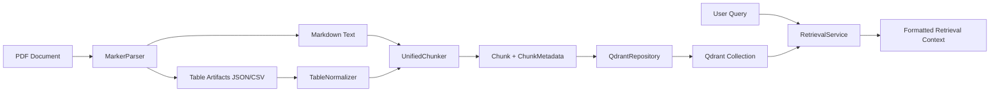
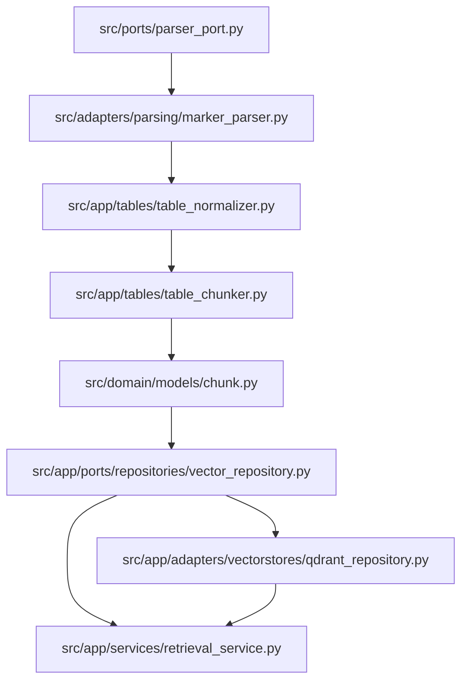

# Architecture

## Introduction

This project is a modular medical-research RAG pipeline built around a clear document-processing path:

1. PDF parsing
2. table normalization
3. unified chunk generation
4. vector persistence
5. document-scoped semantic retrieval

The current implementation covers both ingestion and retrieval-side concerns. A source PDF is converted into Markdown and structured tables, table metadata noise is trimmed, narrative text and tables are chunked with different strategies, the resulting `Chunk` objects are persisted into Qdrant, and a retrieval service queries document-scoped semantic context for downstream generation.

## Architectural Principles

### Hexagonal Architecture

The codebase follows a Hexagonal Architecture (Ports and Adapters) approach. Core application logic is defined in terms of domain models and port contracts, while concrete technologies such as Marker and Qdrant are implemented as adapters behind those contracts.

This pattern was chosen for one reason: decoupling business logic from infrastructure choices. The chunking and normalization rules should not depend on a specific parser or vector database. By isolating integrations behind ports, the system can evolve without rewriting core logic.

### Why Ports and Adapters Here

In a RAG pipeline, infrastructure churn is expected:

- PDF parsers change
- table extraction quality varies by provider
- vector databases may be swapped or upgraded
- embedding strategies may change independently of chunk semantics

Hexagonal Architecture keeps those changes local. Application services continue to operate on stable models such as `Chunk`, while adapters translate to and from external systems.

## System Flow

### End-to-End Sequence

The current document path is:

`PDF -> MarkerParser -> Markdown + table artifacts -> TableNormalizer -> UnifiedChunker -> QdrantRepository -> RetrievalService`

### Sequence Narrative

1. A PDF is parsed by `MarkerParser`.
2. Marker output is separated into narrative Markdown and extracted table artifacts.
3. `TableNormalizer` trims title rows and metadata rows from table-shaped data before chunking.
4. `UnifiedChunker` processes the document as a whole:
   - text is chunked by paragraph-aware sliding windows
   - tables are preserved as atomic structural units
5. `QdrantRepository` converts `Chunk` objects into Qdrant `PointStruct` payloads and upserts them in batches.
6. `RetrievalService` embeds a query, calls the vector repository search contract, and formats retrieved chunks into LLM-ready context text.

### Flow Diagram



## Component Breakdown

| Module | Responsibility | Current Examples |
| --- | --- | --- |
| `src/domain/` | Core business models and system-internal data contracts. No direct infrastructure logic. | `domain/models/chunk.py` |
| `src/ports/` | Cross-cutting port definitions for adapters used by the ingestion pipeline. | `ports/parser_port.py` |
| `src/app/` | Application-layer services and orchestration logic for normalization, chunking, and retrieval formatting. | `app/tables/table_normalizer.py`, `app/tables/table_chunker.py`, `app/services/retrieval_service.py` |
| `src/app/ports/` | Application-facing repository contracts used by adapters. | `app/ports/repositories/vector_repository.py` |
| `src/adapters/` | Technology-specific parser implementations. | `adapters/parsing/marker_parser.py` |
| `src/app/adapters/` | Application-side infrastructure adapters for persistence and vector search. | `app/adapters/vectorstores/qdrant_repository.py` |

## Data Model

### ChunkMetadata

`ChunkMetadata` is the structured metadata envelope attached to every chunk:

```python
@dataclass(frozen=True)
class ChunkMetadata:
    doc_id: str
    chunk_type: str
    parent_header: str
    page_number: int | None = None
    extra: dict[str, Any] = field(default_factory=dict)
```

### Chunk

`Chunk` is the persistence-ready document unit used by the chunker and vector repository:

```python
@dataclass(frozen=True)
class Chunk:
    id: str
    content: str
    metadata: ChunkMetadata
```

### Why Metadata Is Nested

The nested `ChunkMetadata` structure was chosen to keep primary vector content separate from filterable attributes. This maps cleanly to Qdrant, where:

- `content` is the text used for embedding
- `metadata` fields become payload values for filtering

This separation prevents payload concerns from leaking into chunk text logic and makes future metadata expansion explicit through `ChunkMetadata.extra`.

### Retrieval Output Shape

`RetrievalService` converts retrieved `Chunk` objects into a formatted string for the downstream LLM:

```text
Source: [parent_header]
[content]
```

This keeps the repository contract focused on structured retrieval while allowing the application layer to control prompt-facing formatting.

## Design Decisions

### Atomic Structural Chunking for Tables

Tables are not split into smaller semantic fragments. `UnifiedChunker` treats each table as one atomic chunk and prepends a context header containing:

- source file
- table index
- nearest preceding section header

This preserves structure and reduces the risk of destroying relational meaning during retrieval.

### Recursive Semantic Chunking for Text

Narrative Markdown is chunked using a paragraph-aware sliding window. The implementation does not split mid-paragraph, which keeps text chunks semantically coherent while still enforcing chunk-size constraints.

### Idempotent Vector Persistence

`QdrantRepository` uses Qdrant upsert semantics keyed by `Chunk.id`. Re-ingesting the same chunk ID updates the existing point instead of creating duplicates. This is critical for repeatable ingestion runs and partial reprocessing.

### Metadata-Scoped Retrieval

`RetrievalService` depends on the `VectorRepositoryPort.search(...)` contract and currently scopes semantic search by `doc_id`. This enables document-bounded retrieval, which is useful for traceable summarization and evidence-restricted prompting.

### Artifact-Aware Chunking

`UnifiedChunker` can load table artifacts from the same relative `data/` subdirectory as the current document. This makes chunk generation resilient to pipelines where Markdown and table artifacts are emitted as sibling files.

## Future-Proofing

### Adding a New Parser

To add a new parser:

1. implement the `ParserPort` contract
2. place the technology-specific code in an adapter module
3. return the same parsed document structure used by the current application services

This allows the rest of the pipeline to remain unchanged.

### Adding a New Vector Store

To add a new vector store:

1. implement `VectorRepositoryPort`
2. map `Chunk` and `ChunkMetadata` to the target store's document format
3. support both `upsert_chunks(...)` and `search(...)`
4. keep batching, idempotency, and payload persistence behavior consistent

The application layer should continue to depend only on the repository port, not on Qdrant-specific APIs.

## Current Reference Path


