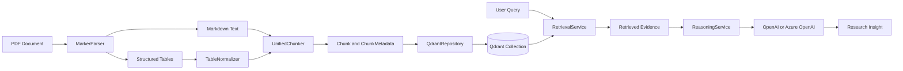
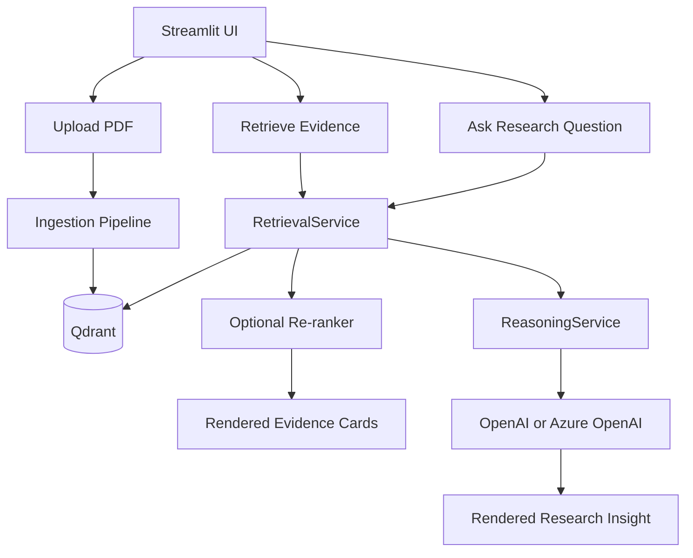
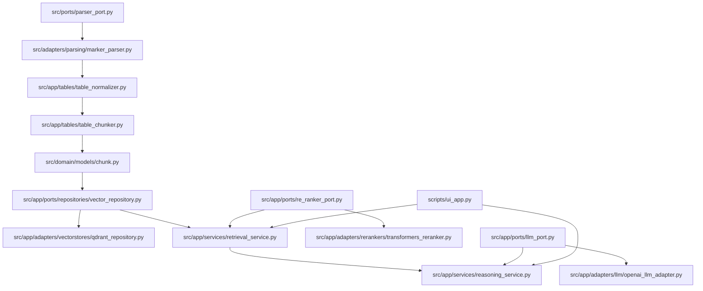

# Architecture

## Introduction

This project is a modular medical-research RAG pipeline built around the following document path:

1. Document parsing
2. Table normalization
3. Unified chunking
4. Vector persistence
5. Retrieval and optional re-ranking
6. Research reasoning over retrieved evidence

The current implementation supports both ingestion and question answering. A source PDF is parsed into Markdown and tables, tables are cleaned before chunking, text and tables are chunked differently, chunks are stored in Qdrant, evidence is retrieved from the indexed knowledge base, and a reasoning layer can synthesize a research answer with an LLM. The repo also now includes an explicit retrieval evaluation harness for repeatable benchmark runs.

## Architectural Principles

### Hexagonal Architecture

The codebase follows Hexagonal Architecture, also known as Ports and Adapters.

Core rules:
- domain models stay independent of infrastructure
- application services depend on port contracts
- technology integrations are implemented as adapters

This pattern was chosen to decouple core document and retrieval logic from specific tooling choices such as Marker, Qdrant, cross-encoder rerankers, and LLM providers.

### Why This Pattern Fits the System

This pipeline has multiple moving parts that are likely to change independently:

- PDF parsers
- table extraction behavior
- vector stores
- embedding providers
- re-rankers
- LLM providers

Hexagonal Architecture keeps those dependencies localized. Application services continue to operate on stable internal types such as `Chunk`, while adapters translate to and from external systems.

## System Flow

### Ingestion and Query Path

The current end-to-end flow is:

`PDF -> MarkerParser -> Markdown + Tables -> TableNormalizer -> UnifiedChunker -> QdrantRepository -> RetrievalService -> ReasoningService`

### Sequence Description

1. A PDF is parsed by `MarkerParser`.
2. Marker output is split into:
   - narrative Markdown
   - structured table artifacts
3. `TableNormalizer` trims metadata rows and title-like rows from extracted tables.
4. `UnifiedChunker` processes the document as a whole:
   - text is chunked with paragraph-aware sliding windows
   - tables are preserved as atomic structural chunks
5. `QdrantRepository` converts `Chunk` objects into Qdrant points and upserts them in batches.
6. `RetrievalService` embeds the query, runs vector search, and optionally re-ranks the initial result pool.
7. Retrieved chunks are formatted into readable evidence blocks.
8. `ReasoningService` can pass that evidence into an LLM to synthesize a research answer.

### System Diagram



## Component Breakdown

| Module | Responsibility | Current Examples |
| --- | --- | --- |
| `src/domain/` | Core business models and stable internal data contracts. No direct infrastructure logic. | `domain/models/chunk.py` |
| `src/ports/` | Cross-cutting parser contract used by ingestion. | `ports/parser_port.py` |
| `src/adapters/` | Parser-side technology adapters. | `adapters/parsing/marker_parser.py` |
| `src/app/` | Application-layer orchestration, chunking, normalization, retrieval formatting, and reasoning. | `app/tables/table_normalizer.py`, `app/tables/table_chunker.py`, `app/services/retrieval_service.py`, `app/services/reasoning_service.py` |
| `src/app/ports/` | Application-facing contracts for vector storage, reranking, and LLM generation. | `app/ports/repositories/vector_repository.py`, `app/ports/re_ranker_port.py`, `app/ports/llm_port.py` |
| `src/app/adapters/` | Infrastructure adapters for vector stores, rerankers, and LLM providers. | `app/adapters/vectorstores/qdrant_repository.py`, `app/adapters/rerankers/transformers_reranker.py`, `app/adapters/llm/openai_llm_adapter.py` |
| `scripts/` | Operational entry points for local testing and the UI. | `scripts/test_single_pdf.py`, `scripts/test_e2e_flow.py`, `scripts/ui_app.py` |

## Data Model

### ChunkMetadata

`ChunkMetadata` is the structured metadata envelope attached to every chunk:

```python
@dataclass(frozen=True)
class ChunkMetadata:
    doc_id: str
    chunk_type: str
    parent_header: str
    page_number: int | None = None
    extra: dict[str, Any] = field(default_factory=dict)
```

### Chunk

`Chunk` is the persistence-ready retrieval unit used across chunking, storage, and retrieval:

```python
@dataclass(frozen=True)
class Chunk:
    id: str
    content: str
    metadata: ChunkMetadata
```

### Why Metadata Is Nested

The nested metadata structure was chosen for clean separation of concerns:

- `content` is the text used for embedding and prompt context
- `metadata` contains filterable and traceable attributes

This maps directly onto Qdrant’s payload model and makes future metadata growth explicit through `ChunkMetadata.extra`.

### Why This Works Well for Qdrant

Qdrant stores:
- an internal point ID
- an embedding vector
- payload metadata

The repository maps:
- `chunk.id` to a deterministic Qdrant-safe point ID
- `chunk.content` into payload for traceability
- `chunk.metadata.*` into payload fields for future filtering and display

## Retrieval and Reasoning Contracts

### VectorRepositoryPort

The vector repository contract isolates search and persistence from Qdrant-specific APIs.

Current responsibilities:
- `upsert_chunks(chunks)`
- `search(vector, doc_id=None, limit=...)`

### ReRankerPort

The re-ranker contract isolates second-stage ranking logic from the retrieval service.

Current responsibility:
- `rank(query, chunks, top_n)`

### LLMPort

The LLM contract isolates answer generation from a specific provider.

Current responsibility:
- `generate(prompt)`

## Design Decisions

### Atomic Structural Chunking for Tables

Tables are preserved as atomic units instead of being split into smaller text fragments. Each table chunk includes context such as:

- source file
- table index
- nearest preceding section header

This protects the relational meaning of tabular data during retrieval and reasoning.

### Paragraph-Aware Text Chunking

Narrative Markdown is chunked with a sliding window that does not break mid-paragraph. This keeps text chunks coherent while still enforcing size limits.

### Opening-Section Normalization

The chunker now normalizes page-1 or title-like opening headers to `Document Metadata/Abstract` when the first discovered header is not a stable structural section. This improves retrieval behavior for papers whose opening markdown begins with the full title rather than a usable section label.

### Two-Stage Retrieval

Retrieval is implemented as:

1. vector search from Qdrant
2. optional cross-encoder re-ranking

This gives the re-ranker a broader candidate pool while keeping the final output focused.

### Idempotent Persistence

`QdrantRepository` uses upsert semantics keyed by deterministic IDs. Re-ingesting the same logical chunk updates the existing record rather than creating duplicates.

### Knowledge-Base Retrieval

Retrieval is currently scoped to the active collection and can search across the indexed knowledge base, rather than being limited to a single document.

### Retrieval Formatting at the Application Layer

`RetrievalService` is responsible for formatting retrieved chunks into readable evidence blocks. This keeps the repository focused on structured retrieval while letting the application layer control prompt-facing and UI-facing presentation.

### Reasoning Built on Retrieval

The system does not bypass retrieval when generating research answers. `ReasoningService` is layered on top of `RetrievalService`, which keeps:

- evidence retrieval testable
- LLM prompting replaceable
- reasoning isolated from storage concerns

## Runtime View

### Local Development Path

Current local operation typically looks like this:

1. Start Qdrant
2. Run Streamlit UI
3. Upload one or more PDFs
4. Ingest them into the current collection
5. Retrieve evidence or ask a research question

### UI Diagram



## Current Reference Paths



## Future-Proofing

### Adding a New Parser

To add a new parser:

1. implement `ParserPort`
2. place the integration in an adapter module
3. return the same parsed document structure

The rest of the ingestion pipeline should remain unchanged.

### Adding a New Vector Store

To add a new vector store:

1. implement `VectorRepositoryPort`
2. map `Chunk` and `ChunkMetadata` to the target store
3. support both persistence and search contracts
4. preserve idempotent behavior

### Adding a New Re-Ranker

To add a new re-ranker:

1. implement `ReRankerPort`
2. keep the interface chunk-in, chunk-out
3. preserve metadata and original chunk identity

### Adding a New LLM Provider

To add a new LLM provider:

1. implement `LLMPort`
2. keep prompt assembly in the application layer
3. keep provider-specific request logic inside the adapter

## Current Limitations

- retrieval quality is currently validated only against a small starter benchmark, so broader corpus-wide behavior is still not well characterized
- the persistent knowledge-base registry is maintained locally and can drift from Qdrant if records are changed outside the app
- Marker extraction quality depends on document layout and OCR performance
- local re-ranking may require a first-run model download
